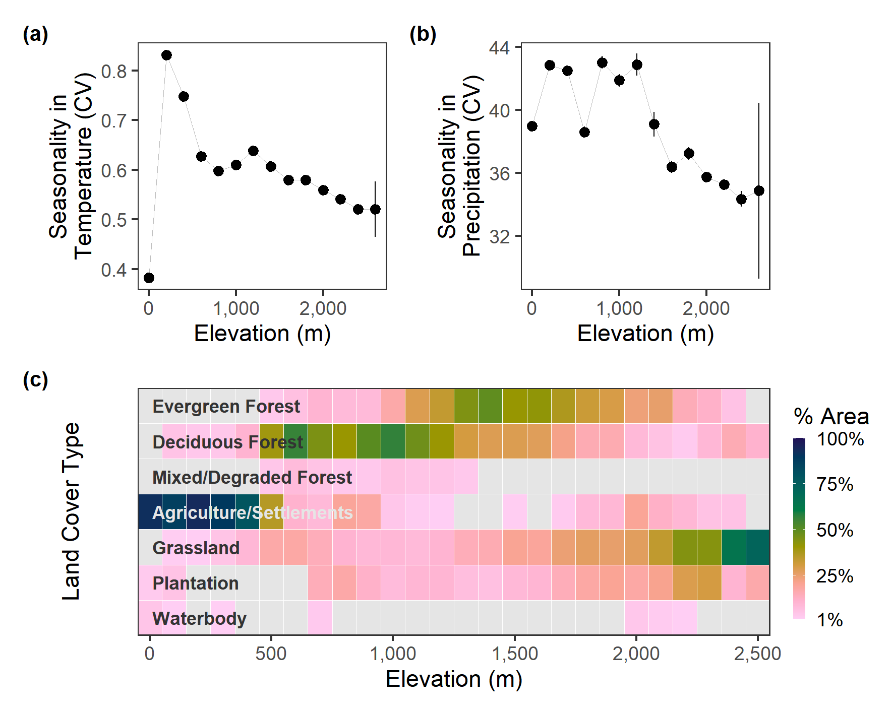

---
editor_options:
  chunk_output_type: console
---

# Preparing Environmental Predictors

In this script, we processed climatic and landscape predictors for occupancy modeling.

All climatic data was obtained from https://chelsa-climate.org/bioclim/
All landscape data was derived from a high resolution land cover map (Roy et al. 2015). This map provides sufficient classes to achieve a high land cover resolution and can be accessed here (https://daac.ornl.gov/VEGETATION/guides/Decadal_LULC_India.html)

The goal here is to resample all rasters so that they have the same resolution of 1km cells. We also tested for spatial autocorrelation among climatic predictors (which can be found in the Supplementary material).

## Prepare libraries

We load some common libraries for raster processing and define a custom mode function.
```{r load_libs2, message=FALSE, warning=FALSE}
# load libs
library(raster)
library(stringi)
library(glue)
library(gdalUtils)
library(purrr)
library(dplyr)
library(tidyr)
library(tibble)

# for plotting
library(viridis)
library(colorspace)
library(tmap)
library(scales)
library(ggplot2)
library(patchwork)

# prep mode function to aggregate
funcMode <- function(x, na.rm = T) {
  ux <- unique(x)
  ux[which.max(tabulate(match(x, ux)))]
}

# a basic test
assertthat::assert_that(funcMode(c(2, 2, 2, 2, 3, 3, 3, 4)) == as.character(2),
  msg = "problem in the mode function"
) # works

# get ci func
ci <- function(x) {
  qnorm(0.975) * sd(x, na.rm = T) / sqrt(length(x))
}
```

## Prepare spatial extent

We prepare a 30km buffer around the boundary of the study area. This buffer will be used to mask the landscape rasters.The buffer procedure is done on data transformed to the UTM 43N CRS to avoid distortions.

```{r load_hills, , message=FALSE, warning=FALSE}
# load hills
library(sf)
hills <- st_read("data/spatial/hillsShapefile/Nil_Ana_Pal.shp")
hills <- st_transform(hills, 32643)
buffer <- st_buffer(hills, 3e4) %>%
  st_transform(4326)
```

## Prepare terrain rasters

We prepare the elevation data which is an SRTM raster layer, and derive the slope and aspect from it after cropping it to the extent of the study site buffer. Please download the latest version of the SRTM raster layer from https://www.worldclim.org/data/worldclim21.html

```{r terrain_raster, , message=FALSE, warning=FALSE}
# load elevation and crop to hills size, then mask by hills
alt <- raster("data/spatial/Elevation/alt") # this layer is not added to github as a result of its large size and can be downloaded from the above link
alt.hills <- crop(alt, as(buffer, "Spatial"))
rm(alt)
gc()

# get slope and aspect
slopeData <- terrain(x = alt.hills, opt = c("slope", "aspect"))
elevData <- raster::stack(alt.hills, slopeData)
rm(alt.hills)
gc()
```

## Prepare Bioclim 4a and Bioclim 15

```{r prepare_bio4a_bio15}
# list chelsa files
chelsaFiles <- list.files("data/chelsa/", recursive = TRUE, pattern = "tif")

# load Bio 1 and 12
bio_1 <- raster("data/chelsa/envicloud/chelsa/chelsa_V1/climatologies/bio/CHELSA_bio10_01.tif")
bio_12 <- raster("data/chelsa/envicloud/chelsa/chelsa_V1/climatologies/bio/CHELSA_bio10_12.tif")
```

## Prepare CHELSA rasters

CHELSA rasters can be downloaded using the `get_chelsa.sh` shell script, which is a `wget` command pointing to the `envidatS3.txt` file.

### Prepare BIOCLIM 4a and 15

We prepare the CHELSA rasters for seasonality in temperature (Bio 4a) and seasonality in precipitation (Bio 15) in the same way, reading them in, cropping them to the study site buffer extent, and handling the temperature layer values which we divide by 10. The CHELSA rasters can be downloaded from https://chelsa-climate.org/bioclim/

```{r chelsa_rasters, , message=FALSE, warning=FALSE}
# list chelsa files
# the chelsa data can be downloaded from the aforementioned link. They haven't been uploaded to github as a result of its large size.
chelsaFiles <- list.files("data/chelsa/",
  full.names = TRUE,
  recursive = TRUE,
  pattern = "bio10"
)

# gather chelsa rasters
chelsaData <- purrr::map(chelsaFiles, function(chr) {
  a <- raster(chr)
  crs(a) <- crs(elevData)
  a <- crop(a, as(buffer, "Spatial"))
  return(a)
})

# divide temperature by 10
chelsaData[[1]] <- chelsaData[[1]] / 10

# stack chelsa data
chelsaData <- raster::stack(chelsaData)
```

### Prepare BIOCLIM 4a

```{r check_for_4a}
if (file.exists("data/chelsa/CHELSA_bio10_4a.tif")) {
  message("Bio 4a already exists, will be overwritten")
}
```


Bioclim 4a, the coefficient of variation temperature seasonality is calculated as

$$Bio\ 4a = \frac{SD\{ Tkavg_1, \ldots Tkavg_{12} \}}{(Bio\ 1 + 273.15)} \times 100$$

where $Tkavg_i = (Tkmin_i + Tkmax_i) / 2$

Here, we use only the months of December and Jan -- May for winter temperature variation.

```{r bioclim_4a}
# list rasters by pattern
patterns <- c("tmin", "tmax")

# list the filepaths
tkAvg <- map(patterns, function(pattern) {
  # list the paths
  files <- list.files(
    path = "data/chelsa",
    full.names = TRUE,
    recursive = TRUE,
    pattern = pattern
  )
})

# print crs elev data for sanity check --- basic WGS84
crs(elevData)

# now run over the paths and read as rasters and crop by buffer
tkAvg <- map(tkAvg, function(paths) {
  # going over the file paths, read them in as rasters, convert CRS and crop
  tempData <- map(paths, function(path) {
    # read in
    a <- raster(path)
    # assign crs
    crs(a) <- crs(elevData)
    # crop by buffer, will throw error if CRS doesn't match
    a <- crop(a, as(buffer, "Spatial"))
    # return a
    a
  })
  # convert each to kelvin, first dividing by 10 to get celsius
  tempData <- map(tempData, function(tmpRaster) {
    tmpRaster <- (tmpRaster / 10) + 273.15
  })
})

# assign names
names(tkAvg) <- patterns

# go over the tmin and tmax and get the average monthly temp
tkAvg <- map2(tkAvg[["tmin"]], tkAvg[["tmax"]], function(tmin, tmax) {
  # return the mean of the corresponding tmin and tmax
  # still in kelvin
  calc(stack(tmin, tmax), fun = mean)
})

# calculate Bio 4a
bio_4a <- (calc(stack(tkAvg), fun = sd) / (chelsaData[[1]] + 273.15)) * 100
names(bio_4a) <- "CHELSA_bio10_4a"
# save bio_4a
writeRaster(bio_4a, filename = "data/chelsa/CHELSA_bio10_4a.tif", overwrite = T)
```

### Prepare Bioclim 15

```{r check_for_15}
if (file.exists("data/chelsa/CHELSA_bio10_15.tif")) {
  message("Bio 15 already exists, will be overwritten")
}
```


Bioclim 15, the coefficient of variation precipitation (in our area, rainfall) seasonality is calculated as

$$Bio\ 15 = \frac{SD\{ PPT_1, \ldots PPT_{12} \}}{1 + (Bio\ 12 / 12)} \times 100$$

where $PPT_i$ is the monthly precipitation.

Here, we use only the months of December and Jan -- May for winter rainfall variation.

```{r bioclim_15}
# list rasters by pattern
pattern <- "prec"

# list the filepaths
pptTotal <- list.files(
  path = "data/chelsa",
  full.names = TRUE,
  recursive = TRUE,
  pattern = pattern
)

# print crs elev data for sanity check --- basic WGS84
crs(elevData)

# now run over the paths and read as rasters and crop by buffer
pptTotal <- map(pptTotal, function(path) {
  a <- raster(path)
  # assign crs
  crs(a) <- crs(elevData)
  # crop by buffer, will throw error if CRS doesn't match
  a <- crop(a, as(buffer, "Spatial"))
  # return a
  a
})

# calculate Bio 4a
bio_15 <- (calc(stack(pptTotal), fun = sd) / (1 + (chelsaData[[2]] / 12))) * 100
names(bio_15) <- "CHELSA_bio10_15"
# save bio_4a
writeRaster(bio_15, filename = "data/chelsa/CHELSA_bio10_15.tif", overwrite = T)
```

### Stack terrain and climate

We stack the terrain and climatic rasters.

```{r stack_rasters, , message=FALSE, warning=FALSE}
# stack rasters for efficient reprojection later
env_data <- stack(elevData, bio_4a, bio_15)
```

## Resample landcover from 10m to 1km

We read in a land cover classified image and resample that using the mode function to a 1km resolution. Please note that the resampling process need not be carried out as it has been done already and the resampled raster can be loaded with the subsequent code chunk.

```{r landcover_raster, , message=FALSE, warning=FALSE, message=FALSE}
# read in landcover raster location
landcover <- "data/landUseClassification/landcover_roy_2015/"

# read in and crop
landcover <- raster(landcover)
buffer_utm <- st_transform(buffer, 32643)
landcover <- crop(
  landcover,
  as(
    buffer_utm,
    "Spatial"
  )
)

# read reclassification matrix
reclassification_matrix <- read.csv("data/landUseClassification/LandCover_ReclassifyMatrix_2015.csv")
reclassification_matrix <- as.matrix(reclassification_matrix[, c("V1", "To")])

# reclassify
landcover_reclassified <- reclassify(
  x = landcover,
  rcl = reclassification_matrix
)

# write to file
writeRaster(landcover_reclassified,
  filename = "data/landUseClassification/landcover_roy_2015_reclassified.tif",
  overwrite = TRUE
)

# check reclassification
plot(landcover_reclassified)

# get extent
e <- bbox(raster(landcover))

# init resolution
res_init <- res(raster(landcover))

# res to transform to 1000m
res_final <- res_init * (1000 / res_init)

# use gdalutils gdalwarp for resampling transform
# to 1km from 10m
gdalUtils::gdalwarp(
  srcfile = "data/landUseClassification/landcover_roy_2015_reclassified.tif",
  dstfile = "data/landUseClassification/lc_01000m.tif",
  tr = c(res_final), r = "mode", te = c(e)
)
```

We compare the frequency of landcover classes between the original raster and the resampled 1km raster to be certain that the resampling has not resulted in drastic misrepresentation of the frequency of any landcover type. This comparison is made using the figure below.

```{r get_resampled_lc, , echo=FALSE}
# landcover <- mask(landcover, mask = as(hills, "Spatial"))
lc_data <- raster("data/landUseClassification/lc_01000m.tif")
# lc_data <- mask(lc_data, mask = as(hills, "Spatial"))
lc_data[lc_data == 0] <- NA

# make raster barplot data
data1km <- raster::getValues(lc_data)
data1km <- table(data1km)
data1km <- data1km / sum(data1km)

data10m <- raster::getValues(landcover_reclassified)
data10m <- tibble(value = data10m)
data10m <- dplyr::count(data10m, value) %>%
  dplyr::mutate(n = n / sum(n))
data10m <- xtabs(n ~ value, data10m)

library(tmap)

# make figures
fig_lc_roy_reclass <-
  tm_shape(landcover_reclassified) +
  tm_raster(
    palette = c(viridis::turbo(6), "grey"), style = "cat",
    title = "Landcover"
  ) +
  tm_shape(hills) +
  tm_borders(col = "white") +
  tm_layout(
    legend.position = c("left", "bottom"),
    panel.labels = "Reclassified Roy et al. 2015 Landcover",
    panel.show = T
  )

fig_lc_1km <-
  tm_shape(lc_data) +
  tm_raster(
    palette = c(viridis::turbo(6), "grey"), style = "cat",
    title = "Landcover"
  ) +
  tm_shape(hills) +
  tm_borders(col = "white") +
  tm_layout(
    legend.position = c("left", "bottom"),
    panel.labels = "Reclassified Landcover, resampled 1km",
    panel.show = T
  )

# save figures
fig_landcover_resample <- tmap_arrange(fig_lc_roy_reclass, fig_lc_1km, ncol = 2)
tmap_save(
  tm = fig_landcover_resample,
  filename = "figs/fig_landcover_resample.png",
  width = 9,
  height = 5
)
```

## Resample other rasters to 1km

We now resample all other rasters to a resolution of 1km.

### Read in resampled landcover

Here, we read in the 1km landcover raster and set 0 to NA.

```{r read_resamp_lc, , message=FALSE, warning=FALSE}
lc_data <- raster("data/landUseClassification/lc_01000m.tif")
lc_data[lc_data == 0] <- NA
```

### Reproject environmental data using landcover as a template

```{r resample_env_data, , message=FALSE, warning=FALSE}
# resample to the corresponding landcover data
env_data_resamp <- projectRaster(
  from = env_data, to = lc_data,
  crs = crs(lc_data), res = res(lc_data)
)

# export as raster stack
land_stack <- stack(env_data_resamp, lc_data)

# get names
land_names <- glue('data/spatial/landscape_resamp{c("01")}_km.tif')

# write to file
writeRaster(land_stack, filename = as.character(land_names), overwrite = TRUE)
```

## Climate seasonality in relation to elevation

### Load resampled environmental rasters

```{r load_rasters_supp3}
# read landscape prepare for plotting
landscape <- stack("data/spatial/landscape_resamp01_km.tif")

# get proper names
elev_names <- c("elev", "slope", "aspect")
chelsa_names <- c("bio_4a", "bio_15")

names(landscape) <- glue('{c(elev_names, chelsa_names, "landcover")}')
```

```{r get_data_at_elev}
# make duplicate stack
land_data <- landscape[[c("elev", chelsa_names)]]

# convert to list
land_data <- as.list(land_data)

# map get values over the stack
land_data <- purrr::map(land_data, getValues)
names(land_data) <- c("elev", chelsa_names)

# conver to dataframe and round to 200m
land_data <- bind_cols(land_data)
land_data <- drop_na(land_data) %>%
  mutate(elev_round = plyr::round_any(elev, 200)) %>%
  dplyr::select(-elev) %>%
  pivot_longer(
    cols = contains("bio"),
    names_to = "clim_var"
  ) %>%
  group_by(elev_round, clim_var) %>%
  summarise_all(.funs = list(~ mean(.), ~ ci(.)))
```

Figure code is hidden in versions rendered as HTML or PDF.

```{r plot_clim_elev, , echo=FALSE}
# make labeller
climvar_names <- c(
  bio_4a = "Seasonality in\nTemperature (CV)",
  bio_15 = "Seasonality in\nPrecipitation (CV)"
)

# split data to list
land_data <- split(land_data, f = land_data$clim_var)

# reorder list to match fig 1
land_data <- land_data[rev(names(land_data))]

subplots_climate_elev <- Map(function(df, climvar) {
  ggplot(df) +
    geom_line(
      aes(
        x = elev_round, y = mean
      ),
      size = 0.2, col = "grey"
    ) +
    geom_pointrange(
      aes(
        x = elev_round, y = mean,
        ymin = mean - ci, ymax = mean + ci
      ),
      size = 0.3
    ) +
    scale_x_continuous(labels = scales::comma) +
    scale_y_continuous(labels = function(x) {
      vapply(x,
        FUN = function(y) {
          # if(is.na(y)) NA_character_
          if (y > 1 & !is.na(y)) {
            sprintf("%.0f", y)
          } else {
            sprintf("%.1f", y)
          }
        },
        FUN.VALUE = "label"
      )
    }) +
    theme_test(base_family = "Arial") +
    labs(x = "Elevation (m)", y = climvar)
}, land_data, climvar_names)

fig_climate_elev <-
  wrap_plots(subplots_climate_elev, ncol = 2) &
    plot_annotation(tag_levels = "A")

# save as png
ggsave(fig_climate_elev,
  filename = "figs/fig_climate_elev.png",
  height = 2, width = 6, device = png(), dpi = 300
)
```

## Climate seasonality across land cover types

Get climate seasonlity values per (re-classified) landcover type from the 1km resampled raster.

```{r}
# make duplicate stack again
lc_clim_data <- landscape[[c("landcover", chelsa_names)]]

# convert to list
lc_clim_data <- as.list(lc_clim_data)

# map get values over the stack
lc_clim_data <- purrr::map(lc_clim_data, getValues)
names(lc_clim_data) <- c("landcover", chelsa_names)

# conver to dataframe for histogram
lc_clim_data <- bind_cols(lc_clim_data)

# pivot long
lc_clim_data <- pivot_longer(
  lc_clim_data,
  cols = contains("bio"),
  names_to = "climvar"
)

# make landcover factor
lc_clim_data <- mutate(
  lc_clim_data,
  landcover = factor(landcover)
)

# filter bio 4a
lc_clim_data <- filter(
  lc_clim_data,
  !is.na(landcover)
)

# split by variable
lc_clim_data <- nest(lc_clim_data, data = c("landcover", "value"))

# assign names
lc_clim_data$climvar_name <- c(
  "Seasonality in Temperature (CV)",
  "Seasonality in Precipitation (CV)"
)
```

Plot density plots of climate seasonality per LC type.

```{r}
# make labels
lc_labels <- c(
  "Evergr. For.", "Decid. For.",
  "Mixed. For.", "Agri./Settl.",
  "Grassland", "Plantation",
  "Waterbody"
)
names(lc_labels) <- c(seq(5), 7, 9)

# plots
lc_clim_plots <- pmap(
  lc_clim_data,
  function(climvar_name, data, climvar) {
    p <- data %>%
      ggplot() +
      geom_histogram(
        aes(
          x = value, y = ..density..,
          fill = ..x..
        ),
        show.legend = F
      ) +
      theme_test(base_family = "Arial") +
      theme(
        legend.key.width = unit(2, units = "mm"),
        axis.text.y = element_blank(),
        axis.text.x = element_text(size = 6),
        axis.ticks.y = element_blank(),
        strip.background = element_blank(),
        strip.text = element_text(size = 6, face = "bold")
      ) +
      facet_grid(
        ~landcover,
        labeller = labeller(
          landcover = lc_labels
        )
      ) +
      labs(
        x = glue("{climvar_name}"),
        y = "Density"
      )
    if (climvar == "bio_4a") {
      p <- p +
        scale_fill_continuous_diverging(
          palette = "Blue-Red 2",
          mid = 0.7
        )
    } else {
      p <- p +
        scale_x_continuous(
          limits = c(20, 60)
        ) +
        scale_fill_continuous_diverging(
          palette = "Blue-Yellow 2",
          mid = 40
        )
    }

    p
  }
)

# save to file and add figure
fig_lc_clim <-
  wrap_plots(lc_clim_plots, ncol = 1) &
    plot_annotation(tag_levels = "A")

# save as png
ggsave(fig_lc_clim,
  filename = "figs/fig_lc_climate.png",
  height = 4, width = 6.5, device = png(), dpi = 300
)
```


## Land cover type in relation to elevation

```{r prep_lc_elev, , message=FALSE}
# get data from landscape rasters
lc_elev <- tibble(
  elev = getValues(landscape[["elev"]]),
  landcover = getValues(landscape[["landcover"]])
)

# process data for proportions
lc_elev <- lc_elev %>%
  filter(!is.na(landcover), !is.na(elev)) %>%
  # round elev to 100m
  mutate(elev = plyr::round_any(elev, 100)) %>%
  count(elev, landcover) %>%
  group_by(elev) %>%
  mutate(prop = n / sum(n))

# fill out lc elev
lc_elev_canon <- crossing(
  elev = unique(lc_elev$elev),
  landcover = unique(lc_elev$landcover)
)

# bind with lcelev
lc_elev <- full_join(lc_elev, lc_elev_canon)

# convert NA to zero
lc_elev <- replace_na(lc_elev, replace = list(n = 0, prop = 0))
```

Figure code is hidden in versions rendered as HTML and PDF.

```{r fig_lc_elev, , message=FALSE, echo=FALSE}
# plot figure as tilemap

# factor order
lc_elev$landcover <- factor(lc_elev$landcover) %>%
  forcats::fct_rev()

# factor labels
lc_labels <- rev(
  c(
    "Evergreen Forest", "Deciduous Forest",
    "Mixed/Degraded Forest", "Agriculture/Settlements",
    "Grassland", "Plantation",
    "Waterbody"
  )
)

fig_lc_elev <-
  ggplot(lc_elev) +
  geom_tile(
    aes(
      x = elev, y = ordered(landcover),
      fill = prop,
    ),
    col = "white"
  ) +
  annotate(
    geom = "text",
    fontface = "bold",
    family = "Arial",
    x = 10,
    y = seq(7),
    col = c(rep("grey20", 3), "grey90", rep("grey20", 3)),
    size = 3,
    label = lc_labels,
    hjust = "inward"
  ) +
  scale_fill_continuous_sequential(
    palette = "Batlow",
    # direction = -1,
    rev = T,
    limits = c(0.01, 1),
    breaks = c(0.01, seq(0.25, 1, 0.25)),
    na.value = "grey90",
    # values = c(0, 1),
    labels = scales::percent,
    name = "% Area"
  ) +
  scale_x_continuous(
    breaks = seq(0, 2500, 500),
    labels = comma
  ) +
  coord_cartesian(expand = F) +
  labs(
    x = "Elevation (m)",
    y = "Land Cover Type"
  ) +
  theme_test(base_family = "Arial") +
  theme(
    legend.key.width = unit(2, units = "mm"),
    axis.text.y = element_blank(),
    axis.ticks.y = element_blank()
  ) +
  labs(fill = NULL)

# export figure
ggsave(fig_lc_elev,
  filename = "figs/fig_lc_elev.png",
  height = 3, width = 6, device = png(), dpi = 300
)
dev.off()
```

## Main Text Figure 2

```{r echo=FALSE}
fig_clim_lc_elev <-
  wrap_plots(fig_climate_elev,
    fig_lc_clim,
    fig_lc_elev,
    ncol = 1,
    design = "A\nB\nB\nC"
  ) +
    plot_annotation(
      tag_levels = "a",
      tag_prefix = "(",
      tag_suffix = ")"
    ) &
    theme(
      plot.tag = element_text(
        size = 10,
        face = "bold",
        family = "Arial"
      )
    )

# save
ggsave(fig_clim_lc_elev,
  filename = "figs/fig_02.png",
  dpi = 300,
  height = 170, width = 150, units = "mm"
)
```


