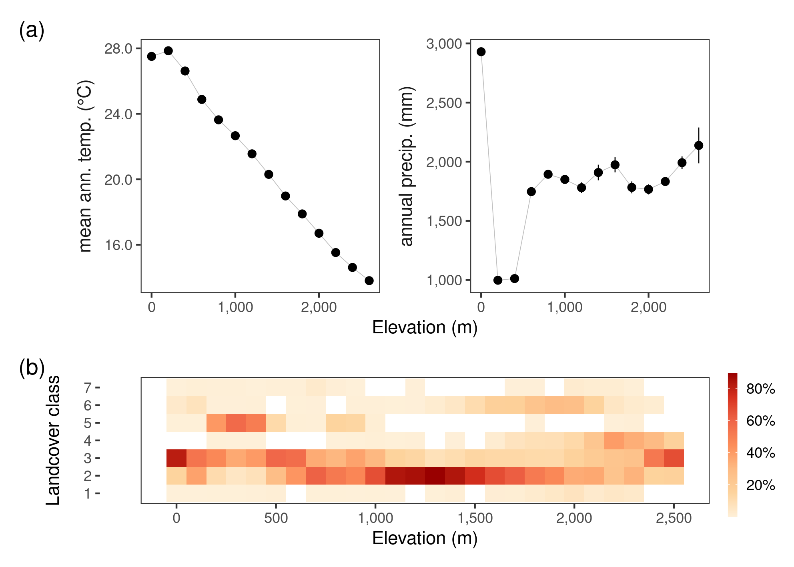

# Prepare landscape data

Here, we prepare environmental layers which we have accessed as raster images from remote sensing platforms using Google Earth Engine.
The GEE code can be found in a separate file.
The goal here is to resample all rasters so that they have the same resolution of 1km cells.

## Prepare libraries

We load some common libraries for raster processing and define a custom mode function.

```{r load_libs2, eval=FALSE, message=FALSE, warning=FALSE}

# load libs
library(raster)
library(stringi)
library(glue)
library(gdalUtils)
library(purrr)

# prep mode function to aggregate
funcMode <- function(x, na.rm = T) {
  ux <- unique(x)
  ux[which.max(tabulate(match(x, ux)))]
}

# a basic test
assertthat::assert_that(funcMode(c(2, 2, 2, 2, 3, 3, 3, 4)) == as.character(2),
  msg = "problem in the mode function"
) # works
```

## Prepare spatial extent

We prepare a 30km buffer around the boundary of the study area. This buffer will be used to mask the landscape rasters.
The buffer procedure is done on data transformed to the UTM 43N CRS to avoid distortions.

```{r load_hills, eval=FALSE, message=FALSE, warning=FALSE}
# load hills
library(sf)
hills <- st_read("data/spatial/hillsShapefile/Nil_Ana_Pal.shp")
hills <- st_transform(hills, 32643)
buffer <- st_buffer(hills, 3e4) %>%
  st_transform(4326)
```

## Prepare terrain rasters

We prepare the elevation data which is an SRTM raster layer, and derive the slope and aspect from it after cropping it to the extent of the study site buffer.

```{r terrain_raster, eval=FALSE, message=FALSE, warning=FALSE}
# load elevation and crop to hills size, then mask by hills
alt <- raster("data/spatial/Elevation/alt")
alt.hills <- crop(alt, as(buffer, "Spatial"))
rm(alt)
gc()

# get slope and aspect
slopeData <- terrain(x = alt.hills, opt = c("slope", "aspect"))
elevData <- raster::stack(alt.hills, slopeData)
rm(alt.hills)
gc()
```

## Prepare CHELSA rasters

We prepare the CHELSA rasters for annual temperature and annual precipitation in the same way, reading them in, cropping them to the study site buffer extent, and handling the temperature layer values which we divide by 10.

```{r chelsa_rasters, eval=FALSE, message=FALSE, warning=FALSE}
# list chelsa files
chelsaFiles <- list.files("data/chelsa/",
  full.names = TRUE,
  pattern = "*.tif"
)

# gather chelsa rasters
chelsaData <- purrr::map(chelsaFiles, function(chr) {
  a <- raster(chr)
  crs(a) <- crs(elevData)
  a <- crop(a, as(buffer, "Spatial"))
  return(a)
})

# divide temperature by 10
chelsaData[[1]] <- chelsaData[[1]] / 10

# stack chelsa data
chelsaData <- raster::stack(chelsaData)
```

We stack the terrain and climatic rasters.

```{r stack_rasters, eval=FALSE, message=FALSE, warning=FALSE}
# stack rasters for efficient reprojection later
env_data <- stack(elevData, chelsaData)
```

## Resample landcover from 10m to 1km

We read in a land cover classified image and resample that using the mode function to a 1km resolution.

```{r landcover_raster, eval=FALSE, message=FALSE, warning=FALSE, message=FALSE}
# read in landcover raster location
landcover <- "data/landUseClassification/Reprojected Image_26thJan2020_UTM_Ghats.tif"

# get extent
e <- bbox(raster(landcover))

# init resolution
res_init <- res(raster(landcover))

# res to transform to 1000m
res_final <- res_init * 100

# use gdalutils gdalwarp for resampling transform
# to 1km from 10m
gdalUtils::gdalwarp(
  srcfile = landcover,
  dstfile = "data/landUseClassification/lc_01000m.tif",
  tr = c(res_final), r = "mode", te = c(e)
)
```

We compare the frequency of landcover classes between the original 10m and the resampled 1km raster to be certain that the resampling has not resulted in drastic misrepresentation of the frequency of any landcover type. This comparison is made using the figure below.

```{r get_resampled_lc, eval=FALSE, echo=FALSE}
# mask by study area
landcover <- raster(landcover)
# landcover <- mask(landcover, mask = as(hills, "Spatial"))
lc_data <- raster("data/landUseClassification/lc_01000m.tif")
# lc_data <- mask(lc_data, mask = as(hills, "Spatial"))
lc_data[lc_data == 0] <- NA

# make raster barplot data
data1km <- raster::getValues(lc_data)
data1km <- data1km[data1km > 0]
data1km <- table(data1km)
data1km <- data1km / sum(data1km)

data10m <- raster::getValues(landcover)
data10m <- data10m[data10m > 0]
data10m <- tibble(value = data10m)
data10m <- dplyr::count(data10m, value) %>% dplyr::mutate(n = n / sum(n))
data10m <- xtabs(n ~ value, data10m)

# map rasters
{
  png(
    filename = "figs/figLandcoverResample.png", width = 1200, height = 1200,
    res = 150
  )
  par(mfrow = c(2, 2))
  # rasterplots
  raster::plot(landcover,
    col = c("white", scico::scico(palette = "batlow", 7)),
    main = "10m sentinel data", xlab = "longitude", y = "latitude"
  )
  plot(hills, add = T, border = "red", col = "transparent")
  raster::plot(rasterAgg1km,
    col = c("white", scico::scico(palette = "batlow", 7)),
    main = "1km resampled data", xlab = "longitude", y = "latitude"
  )
  plot(hills, add = T, border = "red", col = "transparent")

  # barplots
  barplot(data10m,
    xlab = c("landcover class"), ylab = "prop.",
    col = scico::scico(palette = "batlow", 7)
  )
  barplot(data1km,
    xlab = c("landcover class"), ylab = "prop.",
    col = scico::scico(palette = "batlow", 7), alpha = 0.8, add = F
  )
  barplot(data10m,
    xlab = c("landcover class"), ylab = "prop.",
    col = "grey20", border = NA, density = 30, add = T
  )
  dev.off()
}
```

## Resample other rasters to 1km

We now resample all other rasters to a resolution of 1km.

### Read in resampled landcover

Here, we read in the 1km landcover raster and set 0 to NA.

```{r read_resamp_lc, eval=FALSE, message=FALSE, warning=FALSE}
lc_data <- raster("data/landUseClassification/lc_01000m.tif")
lc_data[lc_data == 0] <- NA
```

### Reproject environmental data using landcover as a template

```{r resample_env_data, eval=FALSE, message=FALSE, warning=FALSE}

# resample to the corresponding landcover data
env_data_resamp <- projectRaster(
  from = env_data, to = lc_data,
  crs = crs(lc_data), res = res(lc_data)
)

# export as raster stack
land_stack <- stack(env_data_resamp, lc_data)

# get names
land_names <- glue('data/spatial/landscape_resamp{c("01")}_km.tif')

# write to file
writeRaster(land_stack, filename = as.character(land_names), overwrite = TRUE)
```

## Temperature and rainfall in relation to elevation

### Prepare libraries and CI function

```{r prep_libs_supp03, eval=FALSE}
# load libs
library(dplyr)
library(tidyr)

library(scales)
library(ggplot2)

# get ci func
ci <- function(x) {
  qnorm(0.975) * sd(x, na.rm = T) / sqrt(length(x))
}
```

### Load resampled environmental rasters

```{r load_rasters_supp3, eval=FALSE}
# read landscape prepare for plotting
landscape <- stack("data/spatial/landscape_resamp01_km.tif")

# get proper names
elev_names <- c("elev", "slope", "aspect")
chelsa_names <- c("bio_01", "bio_12")

names(landscape) <- as.character(glue('{c(elev_names, chelsa_names, "landcover")}'))
```

```{r get_data_at_elev, eval=FALSE}
# make duplicate stack
land_data <- landscape[[c("elev", chelsa_names)]]

# convert to list
land_data <- as.list(land_data)

# map get values over the stack
land_data <- purrr::map(land_data, getValues)
names(land_data) <- c("elev", chelsa_names)

# conver to dataframe and round to 100m
land_data <- bind_cols(land_data)
land_data <- drop_na(land_data) %>%
  mutate(elev_round = plyr::round_any(elev, 200)) %>%
  dplyr::select(-elev) %>%
  pivot_longer(
    cols = contains("bio"),
    names_to = "clim_var"
  ) %>%
  group_by(elev_round, clim_var) %>%
  summarise_all(.funs = list(~ mean(.), ~ ci(.)))
```

Figure code is hidden in versions rendered as HTML or PDF.

```{r plot_clim_elev, eval=FALSE, echo=FALSE}
# make labeller
chelsa <- c(
  bio_01 = "Annual Mean Temperature (°C)",
  bio_12 = "Annual Precipitation (mm)"
)

fig_climate_elev <-
  ggplot(land_data) +
  geom_line(aes(x = elev_round, y = mean),
    size = 0.2, col = "grey"
  ) +
  geom_pointrange(aes(x = elev_round, y = mean, ymin = mean - ci, ymax = mean + ci),
    size = 0.3
  ) +
  scale_x_continuous(labels = scales::comma) +
  scale_y_continuous(labels = scales::comma) +
  facet_wrap(~clim_var,
    scales = "free_y",
    labeller = labeller(clim_var = chelsa),
    strip.position = "left"
  ) +
  theme_test() +
  theme(
    strip.placement = "outside",
    strip.background = element_blank(),
    strip.text = element_text(size = 11)
  ) +
  labs(x = "Elevation (m)", y = NULL)

# save as png
ggsave(fig_climate_elev,
  filename = "figs/fig_climate_elev.png",
  height = 3, width = 6, device = png(), dpi = 300
)
```

## Land cover type in relation to elevation

```{r prep_lc_elev, eval=FALSE, message=FALSE}
# get data from landscape rasters
lc_elev <- tibble(
  elev = getValues(landscape[["elev"]]),
  landcover = getValues(landscape[["landcover"]])
)

# process data for proportions
lc_elev <- lc_elev %>%
  filter(!is.na(landcover), !is.na(elev)) %>%
  mutate(elev = plyr::round_any(elev, 100)) %>%
  count(elev, landcover) %>%
  group_by(elev) %>%
  mutate(prop = n / sum(n))

# fill out lc elev
lc_elev_canon <- crossing(
  elev = unique(lc_elev$elev),
  landcover = unique(lc_elev$landcover)
)

# bind with lcelev
lc_elev <- full_join(lc_elev, lc_elev_canon)

# convert NA to zero
lc_elev <- replace_na(lc_elev, replace = list(n = 0, prop = 0))
```

Figure code is hidden in versions rendered as HTML and PDF.

```{r fig_lc_elev, eval=FALSE, message=FALSE, echo=FALSE}
# plot figure as tilemap
fig_lc_elev <-
  ggplot(lc_elev) +
  geom_tile(aes(
    x = elev, y = factor(landcover),
    fill = prop
  ),
  col = "grey"
  ) +
  scale_fill_distiller(
    palette = "OrRd",
    direction = 1,
    na.value = "grey",
    values = c(0, 1),
    labels = scales::percent,
    name = "% area"
  ) +
  scale_y_discrete(
    labels = c(
      "Agriculture", "Forest",
      "Grassland", "Plantations",
      "Settlements", "Tea",
      "Water Bodies"
    )
  ) +
  scale_x_continuous(
    breaks = seq(0, 2500, 500),
    labels = comma
  ) +
  scale_alpha_continuous(range = c(0.3, 1)) +
  coord_cartesian(expand = F) +
  labs(
    x = "Elevation (m)",
    y = "Land Cover Type"
  ) +
  theme_test() +
  theme(legend.key.width = unit(2, units = "mm")) +
  labs(fill = NULL)

# export figure
ggsave(fig_lc_elev,
  filename = "figs/fig_lc_elev.png",
  height = 2, width = 6, device = png(), dpi = 300
)
dev.off()
```

## Main Text Figure 2

```{r}
library(patchwork)
```

```{r echo=FALSE}
fig_clim_lc_elev <-
  wrap_plots(fig_climate_elev, fig_lc_elev,
    ncol = 1,
    design = "AA\nAA\nBB"
  ) +
  plot_annotation(
    tag_levels = "a",
    tag_prefix = "(",
    tag_suffix = ")"
  )

# save
ggsave(fig_clim_lc_elev,
  filename = "figs/fig_02_clim_lc_elev.png",
  dpi = 300,
  height = 120, width = 168, units = "mm"
)
```


