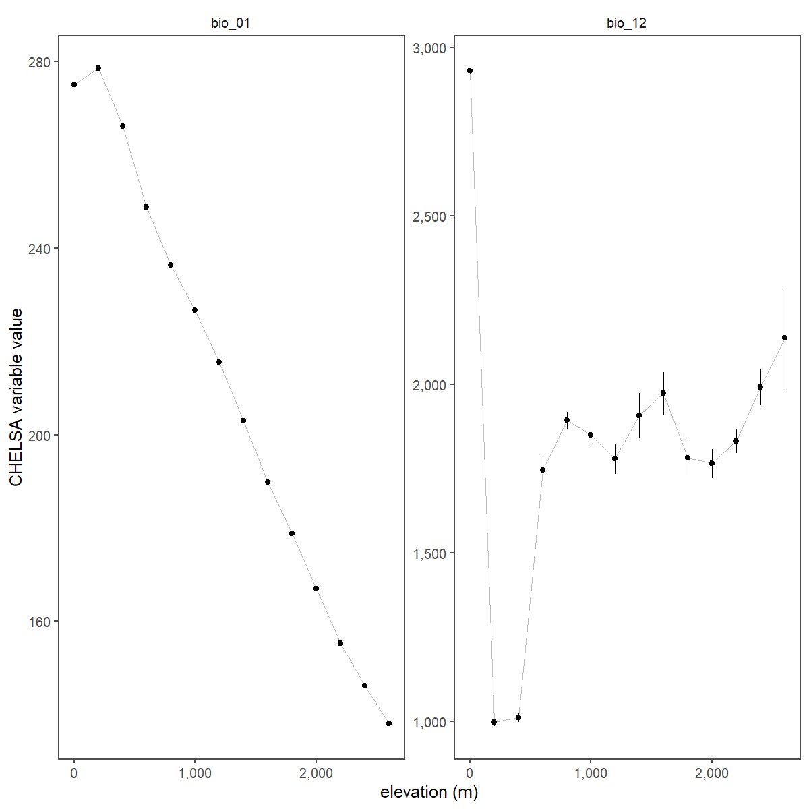

# Prepare landscape data

## Prepare libraries

```{r load_libs2, eval=FALSE, message=FALSE, warning=FALSE}

# load libs
library(raster)
library(stringi)
library(glue)
library(gdalUtils)
library(purrr)

# prep mode function to aggregate
funcMode <- function(x, na.rm = T) {
  ux <- unique(x)
  ux[which.max(tabulate(match(x, ux)))]
}

# a basic test
assertthat::assert_that(funcMode(c(2,2,2,2,3,3,3,4)) == as.character(2), 
                        msg = "problem in the mode function") # works
```

## Prepare initial data

### Prepare spatial extent

```{r load_hills, eval=FALSE, message=FALSE, warning=FALSE}
# load hills
library(sf)
hills <- st_read("data/spatial/hillsShapefile/Nil_Ana_Pal.shp")
hills <- st_transform(hills, 32643)
buffer <- st_buffer(hills, 3e4) %>% 
  st_transform(4326)
```


### Prepare terrain rasters

```{r terrain_raster, eval=FALSE, message=FALSE, warning=FALSE}
# load elevation and crop to hills size, then mask by hills
alt <- raster("data/spatial/Elevation/alt")
alt.hills <- crop(alt, as(buffer, "Spatial"))
rm(alt); gc()

# get slope and aspect
slopeData <- terrain(x = alt.hills, opt = c("slope", "aspect"))
elevData <- raster::stack(alt.hills, slopeData)
rm(alt.hills); gc()
```

### Prepare CHELSA rasters

```{r chelsa_rasters, eval=FALSE, message=FALSE, warning=FALSE}
# list chelsa files
chelsaFiles <- list.files("data/chelsa/", full.names = TRUE, pattern = "*.tif")

# gather chelsa rasters
chelsaData <- purrr::map(chelsaFiles, function(chr){
  a <- raster(chr)
  crs(a) <- crs(elevData)
  a <- crop(a, as(buffer, "Spatial"))
  return(a)
})

# stack chelsa data
chelsaData <- raster::stack(chelsaData)
```

### Stack prepared rasters

```{r stack_rasters, eval=FALSE, message=FALSE, warning=FALSE}
# stack rasters for efficient reprojection later
env_data <- stack(elevData, chelsaData)
```

### Prepare landcover

```{r landcover_raster, eval=FALSE, message=FALSE, warning=FALSE, message=FALSE}
# read in landcover raster location
landcover <- "data/landUseClassification/Reprojected Image_26thJan2020_UTM_Ghats.tif"
# get extent
e = bbox(raster(landcover))

# init resolution
res_init <- res(raster(landcover))
# res to transform to 1000m
res_final <- res_init*100

# use gdalutils gdalwarp for resampling transform
# to 1km from 10m
gdalwarp(srcfile = landcover, 
          dstfile = "data/landUseClassification/lc_01km.tif", 
          tr=c(res_final), r='mode', te=c(e))
```

### Show resampled landcover

```{r show_resampled_lc, eval=FALSE}
# mask by study area
{
  landcover <- raster(landcover)
  # landcover <- mask(landcover, mask = as(hills, "Spatial"))
  lc_data <- raster("data/landUseClassification/lc_01km.tif")
  # lc_data <- mask(lc_data, mask = as(hills, "Spatial"))
  lc_data[lc_data == 0] <- NA
}

# make raster barplot data
data1km = raster::getValues(lc_data); data1km = data1km[data1km > 0]; data1km = table(data1km); data1km = data1km/sum(data1km)

{
  data10m = raster::getValues(landcover); data10m = data10m[data10m > 0]
  data10m = tibble(value = data10m)
  data10m = dplyr::count(a, value) %>% dplyr::mutate(n=n/sum(n))
  data10m = xtabs(n~value, data10m)
}

# map rasters
{
  png(filename = "figs/figLandcoverResample.png", width = 1200, height = 1200,
      res = 150)
  par(mfrow=c(2,2))
  # rasterplots
  raster::plot(landcover, col = c("white", scico::scico(palette = "batlow", 7)), 
               main = "10m sentinel data", xlab = "longitude", y = "latitude")
  plot(hills, add=T, border = "red", col = "transparent")
  raster::plot(rasterAgg1km, col = c("white", scico::scico(palette = "batlow", 7)),
               main = "1km resampled data", xlab = "longitude", y = "latitude")
  plot(hills, add=T, border = "red", col = "transparent")
  
  # barplots
  barplot(data10m, xlab = c("landcover class"), ylab = "prop.",
          col = scico::scico(palette = "batlow", 7))
  barplot(data1km, xlab = c("landcover class"), ylab = "prop.",
          col = scico::scico(palette = "batlow", 7), alpha =0.8), add = F)
  barplot(data10m, xlab = c("landcover class"), ylab = "prop.",
          col = "grey20", border = NA, density = 30, add = T)
  dev.off()
}
```

```{r show_resampling, eval=TRUE, fig.caption="Resampling of Sentinel data from 10m to 1km."}

```

## Resample rasters

### Read landcover as list

Here, we read in the 1km landcover raster and set 0 to NA.

```{r read_resamp_lc, eval=FALSE, message=FALSE, warning=FALSE}
lc_data <- raster("data/landUseClassification/lc_01km.tif")
lc_data[lc_data == 0] <- NA
```

### Reproject environmental data to landcover

```{r resample_env_data, eval=FALSE, message=FALSE, warning=FALSE}

# resample to the corresponding landcover data
env_data_resamp <- projectRaster(from = env_data, to = lc_data, crs = crs(lc_data), res = res(lc_data))

# export as raster stack
land_stack <- stack(env_data_resamp, lc_data)

# get names
land_names <- glue('data/spatial/landscape_resamp{c("01")}km.tif')

# write to file
writeRaster(land_stack, filename = as.character(land_names), overwrite=TRUE)
```

