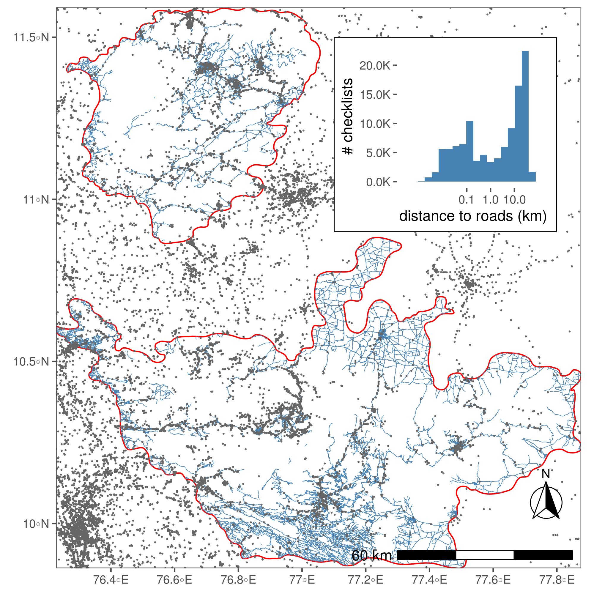

# Distance to roads

## Prepare libraries

```{r setup_python, eval=FALSE}
# load libraries
library(reticulate)
library(sf)
library(dplyr)
library(scales)
library(readr)
library(purrr)

library(ggplot2)
library(ggthemes)
library(ggspatial)
library(scico)

# round any function
round_any <- function(x, accuracy = 20000){round(x/accuracy)*accuracy}
# ci function
ci <- function(x){qnorm(0.975)*sd(x, na.rm = TRUE)/sqrt(length(x))}

# set python path
use_python("/usr/bin/python3")
```

Importing python libraries.

```{python prepare_py_libs, eval=FALSE}
# import classic python libs
import itertools
from operator import itemgetter
import numpy as np
import matplotlib.pyplot as plt
import math

# libs for dataframes
import pandas as pd

# import libs for geodata
from shapely.ops import nearest_points
import geopandas as gpd
import rasterio

# import ckdtree
from scipy.spatial import cKDTree
from shapely.geometry import Point, MultiPoint, LineString, MultiLineString
```

## Prepare data for processing

```{python read_spatial_data, eval=FALSE}
# read in roads shapefile
roads = gpd.read_file("data/spatial/roads_studysite_2019/roads_studysite_2019.shp")
roads.head()

# read in checklist covariates for conversion to gpd
# get unique coordinates, assign them to the df
# convert df to geo-df
chkCovars = pd.read_csv("data/eBirdChecklistVars.csv")
unique_locs = chkCovars.drop_duplicates(subset=['longitude',
                                         'latitude'])[['longitude', 'latitude']]
unique_locs['coordId'] = np.arange(1, unique_locs.shape[0]+1)
chkCovars = chkCovars.merge(unique_locs, on=['longitude', 'latitude'])

unique_locs = gpd.GeoDataFrame(
unique_locs,
geometry=gpd.points_from_xy(unique_locs.longitude, unique_locs.latitude))
unique_locs.crs = {'init' :'epsg:4326'}

# reproject spatials to 43n epsg 32643

roads = roads.to_crs({'init': 'epsg:32643'})
unique_locs = unique_locs.to_crs({'init': 'epsg:32643'})


# function to simplify multilinestrings
def simplify_roads(complex_roads):
    simpleRoads = []
    for i in range(len(complex_roads.geometry)):
        feature = complex_roads.geometry.iloc[i]
        if feature.geom_type == "LineString":
            simpleRoads.append(feature)
        elif feature.geom_type == "MultiLineString":
            for road_level2 in feature:
                simpleRoads.append(road_level2)
    return simpleRoads


# function to use ckdtrees for nearest point finding
def ckdnearest(gdfA, gdfB):
    A = np.concatenate(
    [np.array(geom.coords) for geom in gdfA.geometry.to_list()])
    simplified_features = simplify_roads(gdfB)
    B = [np.array(geom.coords) for geom in simplified_features]
    B = np.concatenate(B)
    ckd_tree = cKDTree(B)
    dist, idx = ckd_tree.query(A, k=1)
    return dist


# function to use ckdtrees for nearest point finding
def ckdnearest_point(gdfA, gdfB):
    A = np.concatenate(
    [np.array(geom.coords) for geom in gdfA.geometry.to_list()])
    #simplified_features = simplify_roads(gdfB)
    B = np.concatenate(
    [np.array(geom.coords) for geom in gdfB.geometry.to_list()])
    #B = np.concatenate(B)
    ckd_tree = cKDTree(B)
    dist, idx = ckd_tree.query(A, k=[2])
    return dist


# get distance to nearest road
unique_locs['dist_road'] = ckdnearest(unique_locs, roads)

# get distance to nearest other site
unique_locs['nnb'] = ckdnearest_point(unique_locs, unique_locs)

# write to file
unique_locs = pd.DataFrame(unique_locs.drop(columns='geometry'))
unique_locs['dist_road'] = unique_locs['dist_road']
unique_locs['nnb'] = unique_locs['nnb']
unique_locs.to_csv(path_or_buf="data/locs_dist_to_road.csv", index=False)

# merge unique locs with chkCovars
chkCovars = chkCovars.merge(unique_locs, on=['latitude', 
                                             'longitude', 'coordId'])
```

## Species specific nearest sites

```{r load_ebd_data_nnb, eval=FALSE}
# load data and send to python
load("data_prelim_processing.rdata")
py$data <- dataGrouped
```


```{python sp_spec_nnb, eval=FALSE}
# split data by species
datalist = [pd.DataFrame(y) for x, y in data.groupby('scientific_name', 
                                                      as_index=False)]


# function to get unique vals anc convert to gpd
def convData(somedata):
    somedata = somedata.drop_duplicates(subset=
    ['longitude','latitude'])[['longitude', 'latitude', 'scientific_name']]
    unique_locs = gpd.GeoDataFrame(somedata,
                                  geometry=gpd.points_from_xy(somedata.longitude, 
                                  somedata.latitude))
    unique_locs.crs = {'init' :'epsg:4326'}
    unique_locs = unique_locs.to_crs({'init': 'epsg:32643'})
    dists = ckdnearest_point(unique_locs, unique_locs)
    unique_locs = pd.DataFrame(unique_locs.drop(columns='geometry'))
    unique_locs['nnb'] = dists
    return unique_locs


# apply function to datalist
datalist = list(map(convData, datalist))
```


## Explicit spatial filter

```{r spatial_filter_supp01, eval=FALSE}
# extract data from python
chkCovars <- py$chkCovars
chkCovars <- st_as_sf(chkCovars, coords = c("longitude", "latitude")) %>% 
  `st_crs<-`(4326) %>% 
  st_transform(32643)

# read wg
wg <- st_read("data/spatial/hillsShapefile/Nil_Ana_Pal.shp") %>% 
  st_transform(32643)

# spatial subset
chkCovars <- chkCovars %>% 
  mutate(id = 1:nrow(.)) %>% 
  filter(id %in% unlist(st_contains(wg, chkCovars)))
```

## Species specific filter

```{r sp_spec_filt, eval=FALSE}
# extract values from python
sp_spec_data <- py$datalist

sp_spec_data <- map(sp_spec_data, function(df){
  df <- as_tibble(df) %>% 
    st_as_sf(coords = c("longitude", "latitude")) %>% 
    `st_crs<-`(4326) %>% 
    st_transform(32643) %>% 
    mutate(id = 1:nrow(.)) %>% 
    filter(id %in% unlist(st_contains(wg, .))) %>% 
    st_drop_geometry()
})

sp_spec_data <- bind_rows(sp_spec_data)
```


## Plot histogram: distance to roads

```{r plot_histogram, eval=FALSE}

# make histogram
hist_roads <- ggplot(chkCovars)+
  geom_histogram(aes(dist_road / 1e3),
                 bins = 20, size=0.2, fill="steelblue")+
  labs(x = "distance to roads (km)", y = "# checklists")+
  scale_x_log10(label=label_number(accuracy = 0.1), 
                breaks = c(0.1, 1, 10))+
  scale_y_continuous(label=label_number(scale=0.001, 
                                        accuracy = 1, suffix = "K"))+
  theme_few()+
  theme(plot.background = element_rect(fill=NA, colour = 1),
        panel.background = element_blank(),
        panel.border = element_blank(), axis.line = element_blank())

```

## Table: Distance to roads

```{r save_global_mean_dist_roads, eval=FALSE}
# write the mean and ci95 to file
chkCovars %>% 
  st_drop_geometry() %>% 
  select(dist_road, nnb) %>% 
  tidyr::pivot_longer(cols = c("dist_road", "nnb"),
                      names_to = "variable") %>%
  group_by(variable) %>% 
  summarise_at(vars(value), 
               list(~mean(.), ~sd(.), ~min(.), ~max(.))) %>% 
  write_csv("data/results/distance_roads_sites.csv")
```

```{r show_dist_roads_nnb, eval=TRUE, message=FALSE}
# read in and show
library(magrittr)
readr::read_csv("data/results/distance_roads_sites.csv") %>% 
  knitr::kable()
```

## Plot histogram: distance to nearest site

```{r plot_nn_site, eval=FALSE}
# get unique locations
locs <- py$unique_locs

# make histogram of nearest neighbours
hist_sites <- 
  ggplot(locs)+
  geom_histogram(aes(nnb / 1e3),
                 bins = 100, size=0.2, fill="steelblue")+
  labs(x = "dist. nearest site (km)", y = "# sites")+
  # scale_x_log10(label=label_number(accuracy = 0.1), 
  #               breaks = c(0.1, 1, 10))+
  coord_cartesian(xlim=c(0,10))+
  scale_y_continuous(label=label_number(scale=0.001, accuracy = 1, 
                                        suffix = "K"))+
  theme_few()+
  theme(plot.background = element_rect(fill=NA, colour = 1),
        panel.background = element_blank(),
        panel.border = element_blank(), axis.line = element_blank())
```

## Plot species specific histograms: distance to nearest site

```{r plot_nn_site_sp, eval=FALSE}
# plot histograms by species
hist_sites_sp <- 
  ggplot(sp_spec_data)+
  geom_histogram(aes(nnb / 1e3),
                 bins = 100, size=0.2, fill="steelblue")+
  labs(x = "dist. nearest site (km)", y = "# sites")+
  # scale_x_log10(label=label_number(accuracy = 0.1), 
  #               breaks = c(0.1, 1, 10))+
  facet_wrap(~scientific_name)+
  scale_x_log10()+
  #coord_cartesian(xlim=c(0,10))+
  scale_y_continuous(label=label_number(scale=0.001, accuracy = 1, 
                                        suffix = "K"))+
  theme_few()+
  theme(plot.background = element_rect(fill=NA, colour = 1),
        panel.background = element_blank(),
        panel.border = element_blank(), axis.line = element_blank())

ggsave(hist_sites_sp, filename = "figs/fig_nnb_species.png")
```

## Table: Species specific nearest site

```{r save_sp_mean_nnb, eval=FALSE}
# write the mean and ci95 to file
sp_spec_data %>% 
  group_by(scientific_name) %>% 
  summarise_at(vars(nnb), 
               list(~mean(.), ~sd(.), ~ci(.), ~min(.), ~max(.))) %>% 
  write_csv("data/results/dist_nnb_species_specific.csv")
```

```{r show_sp_nnb, eval=TRUE, message=FALSE}
# show table of distance to nearest site for each species
readr::read_csv("data/results/dist_nnb_species_specific.csv") %>% 
  knitr::kable()
```

Histograms showing the species-specific distances to nearest neighbouring site.


## Plot map: points on roads

```{r load_data_in_r, eval=FALSE}
roads <- st_read("data/spatial/roads_studysite_2019/roads_studysite_2019.shp") %>% 
  st_transform(32643)
points <- chkCovars %>% 
  bind_cols(as_tibble(st_coordinates(.))) %>% 
  st_drop_geometry() %>% 
  mutate(X = round_any(X, 2500), Y = round_any(Y, 2500))

points <- count(points, X,Y)

# add land
library(rnaturalearth)
land <- ne_countries(scale = 50, type = "countries", continent = "asia",
                     country = "india",
                     returnclass = c("sf")) %>% 
  st_transform(32643)

bbox <- st_bbox(wg)
```

```{r plot_map_dist_roads, eval=FALSE}
# plot on maps
ggplot()+
  geom_sf(data = land, fill = "grey90", col = NA)+
  geom_sf(data = wg, fill= NA, col = 1)+
  annotation_custom(grob = hist_roads %>% ggplotGrob(),
                    xmin = bbox["xmax"] - (bbox["xmax"] - bbox["xmin"])/2.5, 
                    xmax = bbox["xmax"], 
                    ymin = bbox["ymax"] - (bbox["ymax"] - bbox["ymin"])/3, 
                    ymax = bbox["ymax"])+
  geom_tile(data=points, aes(X,Y,fill=n), col = "grey90")+
  
  geom_sf(data=roads, size=0.2, col="steelblue")+
  
  # scale_colour_manual(values = "steelblue", labels = "roads")+
  
  scale_fill_scico(trans = "log10", palette = "lajolla", values=c(0, 1))+
  annotation_north_arrow(location = "br", which_north = "true", 
                         pad_x = unit(0.1, "in"), pad_y = unit(0.5, "in"),
                         style = north_arrow_fancy_orienteering) +
  annotation_scale(location = "br", width_hint = 0.4, text_cex = 1) +
  
  theme_few()+
  theme(legend.position = c(0.9,0.55),
        legend.background = element_blank(),
        legend.key = element_rect(fill="grey90"),
        axis.title = element_blank(),
        panel.background = element_rect(fill="lightblue"))+
  coord_sf(expand = FALSE, 
           xlim = bbox[c("xmin", "xmax")], 
           ylim = bbox[c("ymin", "ymax")])+
  labs(fill = "checklists", colour=NULL)

# save figure
ggsave(filename = "figs/fig_distRoads.png", device = png())
dev.off()
```

```{r plot_map_nnb, eval=FALSE}
# transform points to utm
locs <- locs %>% 
  st_as_sf(coords=c("longitude", "latitude")) %>% 
  `st_crs<-`(4326) %>% 
  st_transform(32643)

# add nnb to locations
ggplot()+
  geom_sf(data = land, fill = "grey90", col = NA)+
  geom_sf(data = wg, fill= NA, col = 1)+
  annotation_custom(grob = hist_sites %>% ggplotGrob(),
                    xmin = bbox["xmax"] - (bbox["xmax"] - bbox["xmin"])/2.5, 
                    xmax = bbox["xmax"], 
                    ymin = bbox["ymax"] - (bbox["ymax"] - bbox["ymin"])/3, 
                    ymax = bbox["ymax"])+
  geom_sf(data=roads, size=0.2, col="steelblue")+
  geom_sf(data=locs, aes(col=nnb/1000))+
  
  scale_colour_scico(palette = "oslo", values=c(0, 1), direction = -1, limits = c(0, 5),
                     na.value = "indianred")+

  annotation_north_arrow(location = "br", which_north = "true", 
                         pad_x = unit(0.1, "in"), pad_y = unit(0.5, "in"),
                         style = north_arrow_fancy_orienteering) +
  annotation_scale(location = "br", width_hint = 0.4, text_cex = 1) +
  
  theme_few()+
  theme(legend.position = c(0.9,0.55),
        legend.background = element_blank(),
        legend.key = element_rect(fill="grey90"),
        axis.title = element_blank(),
        panel.background = element_rect(fill="lightblue"))+
  coord_sf(expand = FALSE, xlim = bbox[c("xmin", "xmax")], 
           ylim = bbox[c("ymin", "ymax")])+
  labs(fill = "checklists", colour=NULL)
```


