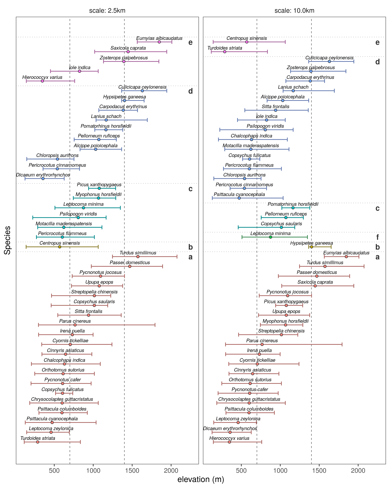

# Results: Best supported hypotheses

## Prepare libraries

```{r load_libs_results, eval=FALSE}
# load libraries
library(dplyr)
library(readr)
library(forcats)
library(tidyr)

# plotting
library(ggplot2)
library(ggthemes)
library(scico)
```

## Prepare data

```{r load_data_results, eval=FALSE}
# load data
data <- list.files(path = "data/results",
                   pattern = "ElevationSummary",
                   full.names = TRUE)
data <- lapply(data, readxl::read_excel)

# attach scale
sp_scale <- c("10.0km", "2.5km")
data <- purrr::map2(data, sp_scale, function(df, sp_scale){
  df$scale = sp_scale
  return(df)
})

# prepare data
data <- data %>% 
  bind_rows() %>% 
  group_by(scale) %>% 
  arrange(Hypothesis, median) %>% 
  group_by(scale) %>% 
  mutate(plot_order = 1:length(median)) %>% 
  ungroup() %>% 
  mutate(scale = as_factor(scale))

# plot positions of hypothesis code
data_hyp <- count(data, scale, Hypothesis) %>%
  group_by(scale) %>% 
  mutate(plot_pos = cumsum(n)) %>% 
  ungroup() %>% 
  mutate(Hypothesis = as_factor(Hypothesis),
         plot_letter = letters[as.numeric(Hypothesis)])
```

## Main text Figure 3

```{r plot_fig_3, eval=FALSE}
# make figure 3 using option 1
fig_hypothesis_elev <- 
  ggplot(data, aes(x = plot_order, y = median,
                   col = Hypothesis))+
  geom_hline(yintercept = c(700,1400),
             lty = 2, size = 0.2)+
  geom_errorbar(width = 0.4,
                aes(ymin = q1, ymax = q3,))+
  geom_point(aes(fill = Hypothesis),
             shape = 21, col = "grey20")+
  geom_text(aes(label = Species), 
            size = 2.5,
            fontface = "italic",
            nudge_x = 0.4, col = "black")+
  geom_text(data = data_hyp,
            aes(x = plot_pos, y = 2250,
                label = plot_letter),
            col = "grey20", fontface = "bold")+
  geom_vline(data = data_hyp,
             aes(xintercept = plot_pos + 0.5),
             lty = 3, lwd = 0.4, col = "grey")+
  scale_color_hue(l = 50, c = 50)+
  scale_fill_hue(l = 70)+
  theme_few()+
  theme(legend.position = "none",
        legend.key = element_rect(colour = "white",
                                  size = 0.3),
        axis.text.y = element_blank(),
        axis.ticks.y = element_blank())+
  labs(y = "elevation (m)", x = "Species",
       colour = "Best supported\nhypothesis")+
  
  coord_flip()+
  facet_wrap(~scale, labeller = label_both)

# save figure
# save figure
ggsave(fig_hypothesis_elev,
       filename = "figs/fig_hyp_elev.png",
       height = 10, width = 8)
```

```{r show_fig_3, eval=TRUE}

```


## Plot supplementary Figure 3

This figure is intended to show the change (or not) in best supported hypothesis between spatial scales.

### Prepare data

```{r prep_data_supplement_fig3, eval=FALSE}
# load data again
data <- list.files(path = "data/results",
                   pattern = "ElevationSummary",
                   full.names = TRUE)
data <- lapply(data, readxl::read_excel)

# attach scale
sp_scale <- c("10.0km", "2.5km")
data <- purrr::map2(data, sp_scale, function(df, sp_scale){
  df$scale = sp_scale
  return(df)
})

# unlist and prepare to plot
data <- data %>%
  bind_rows() %>% 
  arrange(Hypothesis) %>% 
  # select(Species, median, Hypothesis, scale)
  mutate(Hypothesis = as_factor(Hypothesis)) %>% 
  pivot_wider(names_from = "scale",
            values_from = "Hypothesis",
            names_prefix = "hypothesis_")

# set order
data <- arrange(data, median) %>% 
  ungroup() %>% 
  mutate(plot_order = 1:nrow(data))
```

```{r plot_fig_3_supplement, eval=FALSE}
# make figure 3 for supplementary material
fig_hypothesis_elev_supp <-
  ggplot(data, aes(x = plot_order,
                 y = median, ymin = q1, ymax = q3))+
  geom_hline(yintercept = c(700,1400),
             lty = 2, size = 0.2)+
  geom_errorbar(size = 0.3, width = 0.4)+
  geom_point(fill = "grey", shape = 21)+
  geom_text(aes(label = Species), 
            size = 3,
            fontface = "italic",
            nudge_x = 0.5)+
  
  geom_label(aes(y = 2500,
                 col = hypothesis_10.0km,
                 label = as.numeric(hypothesis_10.0km)),
             label.padding = unit(0.2, "lines"),
             fontface = "bold",
             fill = "grey95", size = 3)+
  geom_label(aes(y = 2250,
                 col = hypothesis_2.5km,
                 label = as.numeric(hypothesis_2.5km)),
             label.padding = unit(0.2, "lines"),
             fontface = "bold",
             fill = "grey95", size = 3)+
  annotate(geom = "text",
           x = c(45, 43, 43), y = c(2375, 2250, 2500),
           label = c("best supported\nhypothesis","2.5km", "10km"))+
  scale_colour_scico_d(end = 0.6)+
  scale_y_continuous(breaks = c(seq(0, 2000, 500)))+
  # scale_fill_hue(l = 100, c = 50)+
  coord_flip()+
  theme_few()+
  theme(legend.position = "none",
        legend.key = element_rect(colour = "white",
                                  size = 0.3),
        axis.text.y = element_blank(),
        axis.ticks.y = element_blank())+
  labs(y = "elevation (m)", x = "Species",
       colour = "Best supported\nhypothesis")

# save figure
ggsave(fig_hypothesis_elev_supp, 
       filename = "figs/fig_hyp_elev_supp.png",
       height = 10, width = 6)
```

## Show Figure 3 Supplement

```{r show_figure_3, eval = TRUE}
knitr::include_graphics("figs/fig_hyp_elev_supp.png")
```

