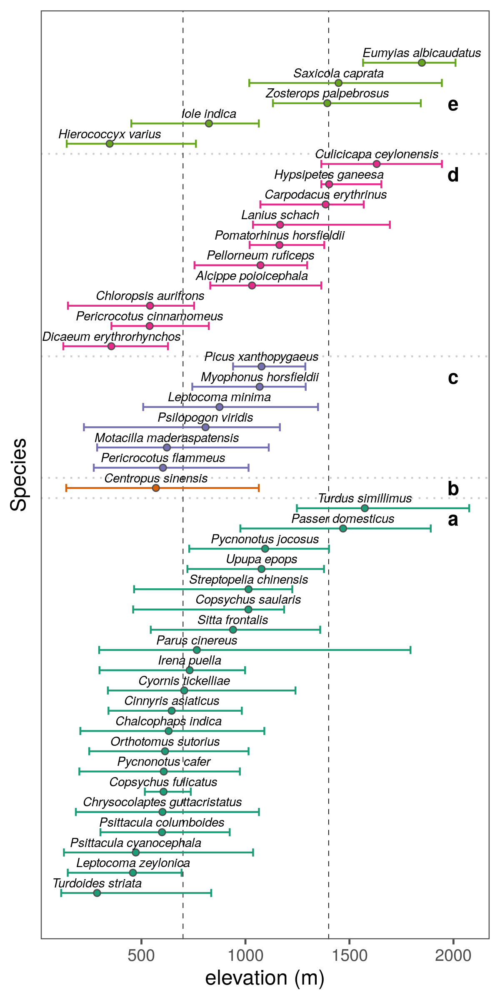

# Results

## Prepare libraries

```{r load_libs_results, eval=FALSE}
# load libraries
library(dplyr)
library(readr)
library(forcats)

# plotting
library(ggplot2)
library(ggthemes)
library(pals)
```

## Prepare data

```{r load_data_results, eval=FALSE}
# load data
data <- list.files(path = "data/results",
                   pattern = "ElevationSummary",
                   full.names = TRUE)
data <- lapply(data, read_csv)

# attach scale
sp_scale <- c("2.5km", "10km")
data <- purrr::map2(data, sp_scale, function(df, sp_scale){
  df$scale = sp_scale
  return(df)
})

# unlist and prepare to plot
data <- data %>%
  bind_rows() %>% 
  arrange(Hypothesis) %>% 
  # select(Species, median, Hypothesis, scale)
  mutate(Hypothesis = as_factor(Hypothesis)) %>% 
  pivot_wider(names_from = "scale",
            values_from = "Hypothesis",
            names_prefix = "hypothesis_")

# set order
data <- arrange(data, median) %>% 
  mutate(plot_order = 1:nrow(data))
  
```

## Plot Figure 3 (heading to be changed)

```{r plot_fig_3, eval=FALSE}
# make figure 3 and add text to error bars
fig_elevation_coefficient <- 
  ggplot(data, aes(x = plot_order, 
                 y = median, ymin = q1, ymax = q3))+
  geom_hline(yintercept = c(700,1400),
             lty = 2, size = 0.2)+
  geom_errorbar(size = 0.3, width = 0.4)+
  geom_point(fill = "grey", shape = 21)+
  geom_label(aes(y = median + 500,
                 col = hypothesis_10km,
                label = as.numeric(hypothesis_10km)),
             label.padding = unit(0.2, "lines"),
             fontface = "bold",
             fill = "grey95", size = 3)+
  geom_label(aes(y = median - 500,
                 col = hypothesis_2.5km,
                label = as.numeric(hypothesis_2.5km)),
             label.padding = unit(0.2, "lines"),
             fontface = "bold",
             fill = "grey95", size = 3)+
  geom_text(aes(label = Species), 
            size = 3,
            fontface = "italic",
            nudge_x = 0.5)+
  scale_colour_scico_d(end = 0.6)+
  # scale_fill_hue(l = 100, c = 50)+
  coord_flip()+
  theme_few()+
  theme(legend.position = c(0.8, 0.15),
        legend.key = element_rect(colour = "white",
                                  size = 0.3),
        axis.text.y = element_blank(),
        axis.ticks.y = element_blank())+
  labs(y = "elevation (m)", x = "Species",
       colour = "Best supported\nhypothesis")+
  guides(colour = guide_legend(override.aes = list(label = 1:6), nrow = 6))

# save figure
ggsave(fig_elevation_coefficient, 
       filename = "figs/fig_elevation_coefficient.png",
       height = 10, width = 6.5)
```

## Show Figure 3

```{r show_figure_3, eval = TRUE}

```

