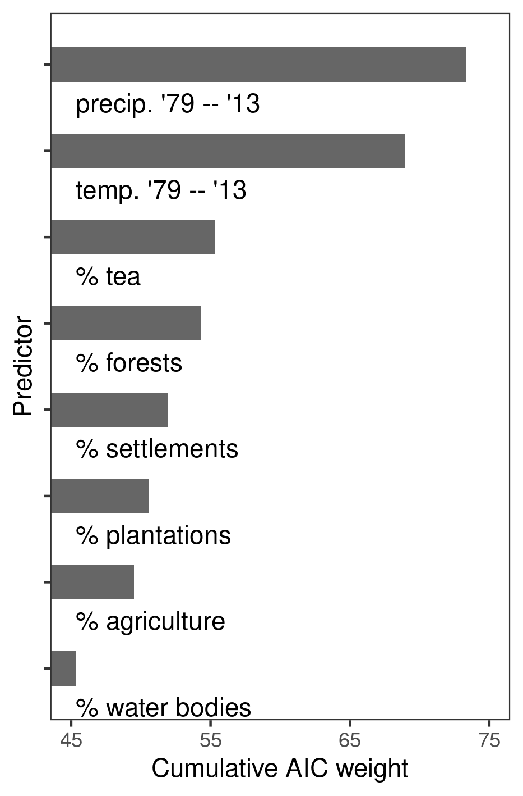
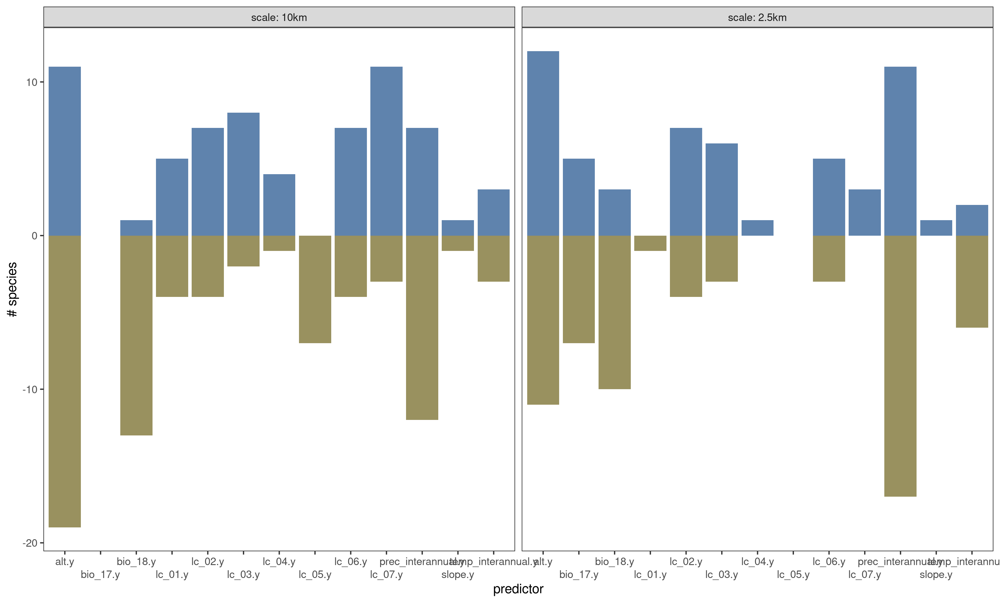
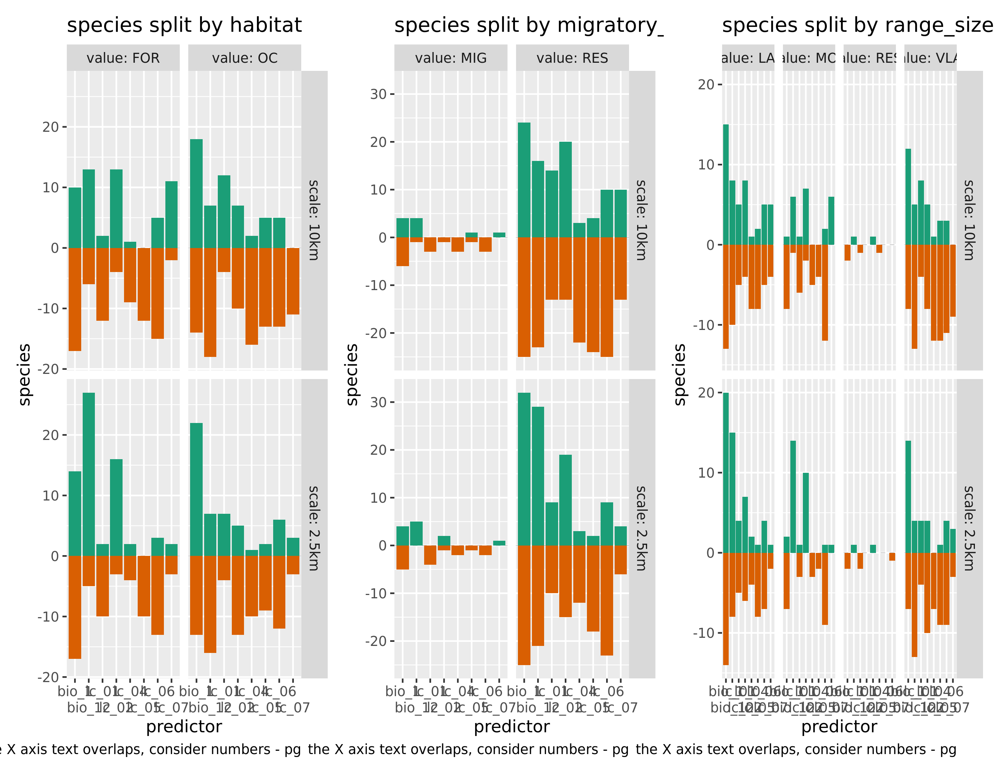

# Results: Occupancy predictors

## Prepare libraries

```{r load_libs_results01, eval=FALSE}
# to load data
library(readxl)

# to handle data
library(dplyr)
library(readr)
library(forcats)
library(tidyr)
library(purrr)
library(stringr)

# to wrangle models
source("code/fun_model_estimate_collection.r")
source("code/fun_make_resp_data.r")

# nice tables
library(knitr)
library(kableExtra)

# plotting
library(ggplot2)
library(patchwork)
source("code/fun_plot_interaction.r")
```

## Read species trait data and the final list of species

```{r eval=FALSE}
# list of species
species <- read_csv("data/species_list.csv")
list_of_species <- as.character(species$scientific_name)

# trait data
species_trait <- read_csv("data/data_species_traits.csv")
```

## Show AIC weights

### Read in weight data

```{r}
# which files to read
file_names <- c("data/results/occu-2.5km/occuCovs/modelImp/lc-clim-imp.xlsx",
                "data/results/occu-10km/occuCovs/modelImp/lc-clim-imp.xlsx")

# read in sheets by species
model_imp <- map(file_names, function(f) {
  md_list <- map(list_of_species, function(sn) {
    
    # some sheets are not found
    
    tryCatch({
      
      readxl::read_excel(f, sheet = sn) %>% 
        `colnames<-`(c("predictor", "AIC_weight")) %>% 
        filter(str_detect(predictor, "psi")) %>% 
        mutate(predictor = stringr::str_extract(predictor, 
                                pattern = stringr::regex("\\((.*?)\\)")),
               predictor = stringr::str_replace_all(predictor, "[//(//)]", ""),
               predictor = stringr::str_remove(predictor, "\\.y"))
      
      },
      error = function(e) {
        message(as.character(e))
      }
    )
  })
  names(md_list) <- list_of_species
  
  return(md_list)
})
```

Sheets for one laughingthrush _Montecincla fairbankii_ and one barbet _Psilopogon viridis_ are not found at both scales.

### Show cumulative weights as plot

```{r}
# assign scale
names(model_imp) <- c("2.5km", "10km")
model_imp <- imap(model_imp, function(.x, .y) {
  .x <- bind_rows(.x)
  .x$scale <- .y
  return(.x)
})

# bind rows
model_imp <- map(model_imp, bind_rows) %>% 
  bind_rows()

# convert to numeric
model_imp$AIC_weight <- as.numeric(model_imp$AIC_weight)
model_imp$scale <- as.factor(model_imp$scale)
levels(model_imp$scale) <- c("2.5km", "10km")

# summ by scale and predictor
model_imp <- group_by(model_imp, predictor, scale) %>% 
  summarise(AIC_weight_cumulative = sum(AIC_weight))
```

### Make plot

```{r}
ggplot(model_imp)+
  geom_point(aes(predictor, AIC_weight_cumulative,
               col = scale),
             size = 3,
           position = position_dodge(width = 0.5))+
  geom_col(aes(predictor, AIC_weight_cumulative,
               fill = scale),
           colour = NA,
           width = 0.1,
           alpha = 0.5,
           position = position_dodge(width = 0.5))+
  theme_minimal()+
  theme(legend.position = "top")

ggsave("figs/fig_aic_weight.png", dpi = 300)
```



## Read model estimates

```{r read_model_estimates, eval=FALSE}
file_read <- c("data/results/occu-2.5km/occuCovs/modelEst/lc-clim-modelEst.xlsx",
               "data/results/occu-10km/occuCovs/modelEst/lc-clim-modelEst.xlsx")

# read data as list column
model_est <- map(file_read, function(fr) {
  md_list <- map(list_of_species, function(sn) {
    readxl::read_excel(fr, sheet = sn)
  })
  names(md_list) <- list_of_species
  
  return(md_list)
})

# prepare model data
scales = c("2.5km", "10km")
model_data <- tibble(crossing(scale = scales, 
                              scientific_name = list_of_species)) %>% 
  arrange(desc(scale))

# rename model data components and separate predictors
names <- c("predictor", "coefficient", "se", "ci_lower", 
           "ci_higher", "z_value", "p_value")

# get data for plotting:
model_est <- map(model_est, function(l) {
  map(l, function(df) {
    colnames(df) <- names
    df <- separate_interaction_terms(df)
    df <- make_response_data(df) 
    return(df)
  })
})

# add names and scales
model_est <- map(model_est, function(l) {
  imap(l, function(.x, .y) {
    mutate(.x, scientific_name = .y)
  })
})

# add names to model estimates
names(model_est) <- scales
model_est <- imap(model_est, function(.x, .y) {
  bind_rows(.x) %>% 
    mutate(scale = .y)
})

# remove modulators
model_est <- bind_rows(model_est) %>% 
  select(-matches("modulator"))

# join data to species name
model_data <- model_data %>% 
  left_join(model_est)
```

### Export data to file

Export predictor effects.

```{r}
# get predictor effect data
data_predictor_effect <- distinct(model_data, 
                                  scientific_name, scale, 
                                  predictor, coefficient)

# write to file
write_csv(data_predictor_effect,
          path = "data/results/data_predictor_effect.csv")
```

Export model data.

```{r}
model_data_to_file <- model_data %>% 
  select(predictor, data,
         scientific_name, scale) %>% 
  unnest(cols = "data")

# remove .y
model_data_to_file <- model_data_to_file %>% 
  mutate(predictor = str_remove(predictor, "\\.y"))

write_csv(model_data_to_file,
          "data/results/data_occupancy_predictors.csv")
```

## Occupancy predictors' aggregated effect

```{r}
# read from file
model_data <- read_csv("data/results/data_predictor_effect.csv")
```

Plot the number of species affected and the direction of the effect, for each predictor.
Split the data along the axes of range size, migratory status, and habitat.

### Add trait data and clean

```{r}
# add trait by joining
data_predictor_effect <- data_predictor_effect %>% 
  left_join(species_trait, by = "scientific_name")
```


```{r}
# remove .y from predictors
data_predictor_effect <- data_predictor_effect %>%
  mutate_at(.vars = c("predictor"), .funs = function(x){
    stringr::str_remove(x, ".y")
  })
```

What is the direction of the predictor effect for each subset of the data by the distribution, habitat, and migratory status?

### Get predictor effects

```{r}
# first pivot the data longer
data_predictor_long <- data_predictor_effect %>% 
  pivot_longer(cols = c("range_size", "migratory_status", 
                        "habitat", "elev"), 
               names_to = "trait")

# reorder scale
data_predictor_long <- data_predictor_long %>% 
  mutate(scale = fct_relevel(scale, "2.5km", "10km"))

# is the coeff positive? how many positive per scale per predictor per axis of split?
data_predictor_long <- mutate(data_predictor_long, 
                                direction = coefficient > 0) %>% 
  count(scale, predictor, 
        trait, value, direction) %>% 
  mutate(mag = n * (if_else(direction, 1, -1)))

# wrangle data to get nice bars
data_predictor_long <- data_predictor_long %>% 
  select(-n) %>% 
  drop_na(direction, value) %>% 
  mutate(direction = ifelse(direction, "positive", "negative")) %>% 
  pivot_wider(values_from = "mag", names_from = "direction") %>% 
  mutate_at(vars(positive, negative),
            ~if_else(is.na(.), 0, .))

data_predictor_long <- data_predictor_long %>% 
  pivot_longer(cols = c("negative", "positive"),
               names_to = "effect",
               values_to = "magnitude")

# write
write_csv(data_predictor_long,
          path = "data/results/data_predictor_long.csv")

# nest the data by trait
data_predictor_long <- data_predictor_long %>% 
  nest(data = -trait)
```

### Manual edits to levels

```{r}
# arrange data predictor long elevation in order of values
data_predictor_long$data[[1]]$value <- as.factor(data_predictor_long$data[[1]]$value)
levels(data_predictor_long$data[[1]]$value) <- c("Low", "Mid", "High")
```


### Make figures for predictor effects

```{r}
# visualise the data by mapping over the nested list
data_predictor_long <- mutate(data_predictor_long,
        figs = map2(data, trait, function(df, tr){
          ggplot(df)+
            geom_hline(yintercept = 0,
                       lty = 2, lwd = 0.2,
                       col = "grey")+
            
            geom_col(aes(x = factor(predictor),
                         y = magnitude,
                         fill = effect))+
            
            scale_x_discrete(guide = guide_axis(n.dodge = 2)#,
                             # label = 1:length(unique(df$predictor))
            )+
            
            scico::scale_fill_scico_d(palette = "berlin",
                                     direction = -1,
                                     begin = 0.1,
                                     end = 0.9)+
            
            theme_grey(base_family = "TT Arial")+
            theme(legend.position = "none")+
            facet_grid(value ~ scale, 
                       labeller = label_both)+
            labs(x = "predictor", y = "species",
                 title = glue::glue('trait: {tr}'))
        }))

fig_predictor_effect <- patchwork::wrap_plots(data_predictor_long$figs,
                                              nrow = 2)

# save plot
ggsave(fig_predictor_effect, filename = "figs/fig_predictor_effect.png",
       dpi = 300,
       width = 12)
```

```{r show_reverse_bar, eval=TRUE}

```

### Tabulate predictor effect

```{r eval=TRUE, results="asis"}
# read again and nest
data_predictor_long <- readr::read_csv("data/results/data_predictor_long.csv")

# nest the data by trait
data_predictor_long <- tidyr::nest(data_predictor_long,
                                   data = -trait)

# first pivot the data columns
purrr::pwalk(data_predictor_long, function(trait, data) {
  predictors <- unique(data$predictor)
  headers <- c(1, 1, rep(2, length(predictors)))
  names(headers) <- c(rep(" ", 2), predictors)
  
  data %>% 
    tidyr::drop_na() %>% 
    tidyr::pivot_wider(names_from = c("predictor", "effect"), 
                values_from = "magnitude") %>% 
    
    
    `colnames<-`(c("spatial scale", glue::glue("{trait} class"),
                 rep(c("+ve", "-ve"), length(predictors)))) %>% 
    knitr::kable(caption = glue::glue("Predictor effects for {trait}")) %>% 
    kableExtra::kable_styling("striped", full_width = F,
                              font_size = 8) %>% 
    kableExtra::add_header_above(headers) %>% 
    print()
  cat("\n")
})
```


## Land cover or climate?

Group the predictor data by two broad classes, landcover or climate.

### Get the effect of landcover or climate

```{r}
# remove figs and unnest
data_predictor_long <- data_predictor_long %>% 
  select(!matches("figs")) %>% 
  unnest(data)

# group by predictor
data_lc_v_clim <- data_predictor_long %>% 
  mutate(predictor = if_else(str_detect(predictor, "bio"), 
                             "climate", "landcover")) %>% 
  group_by(trait, scale, predictor, value, effect) %>%
  summarise_at(.vars = c("magnitude"),
               .funs = list(sum))
```

```{r}
# nest on trait
data_lc_v_clim <- nest(data_lc_v_clim,
                       cols = -trait)
```


### Plot a figure

```{r}
# make list of figures
data_lc_v_clim$figs <- pmap(data_lc_v_clim[,c("trait", "cols")],
                           function(trait, cols) {
                             ggplot(cols) +
                               geom_col(aes(predictor, magnitude,
                                            fill = effect),
                                        width = 0.4) +
                               
                               scico::scale_fill_scico_d(palette = "berlin",
                                                      direction = -1,
                                                      begin = 0.1, end = 0.9)+
                               theme_grey(base_family = "TT Arial") +
                               theme(legend.position = "none") +
                               
                               facet_grid(value ~ scale,
                                          labeller = label_both) +
                               labs(title = glue::glue('trait: {trait}'))
                           })
fig_lc_v_clim <- patchwork::wrap_plots(data_lc_v_clim$figs,
                                       nrow = 2)

# save plot
ggsave(fig_lc_v_clim, filename = "figs/fig_lc_v_clim.png",
       dpi = 300)
```

```{r}

```

## Elevation summary THIS NEEDS TO BE REMOVED

Plot elevation summaries faceted by scale and predictors.
Read species elevation summaries.

```{r}
# add elevation data
elev_summary <- read_excel("data/data_species_elevation.xlsx")

# link to species
elev_summary <- elev_summary %>% 
  left_join(data_predictor_effect)

# arrange in plot order
elev_summary <- elev_summary %>% 
  group_by(scale, scientific_name) %>% 
  arrange(median) %>% 
  mutate(plot_order = seq_len(n()))

# remove NAs and order scale
elev_summary <- select(elev_summary,
                       -`Body mass`) %>% 
  drop_na() %>% 
  mutate(scale = fct_relevel(scale,
                             "2.5km", "10km"))

# rename median
elev_summary <- rename(elev_summary,
                       median_elev = median)

# order
elev_summary <- elev_summary %>% 
  ungroup() %>% 
  arrange(-median_elev) %>% 
  group_by(scientific_name)
```

```{r}
# plot elevation pointranges
ggplot(elev_summary)+
  geom_errorbar(aes(plot_order, 
                    ymin = q1, ymax = q3),
                size = 0.3, width = 0.4)+
  geom_point(aes(plot_order, median_elev),
             shape = 21, col = "grey20")+
  facet_grid(scale ~ predictor, 
             scales = "fixed",
             labeller = label_both,
             as.table = FALSE)+
  theme_test()+
  theme(legend.position = "none",
        legend.key = element_rect(colour = "white",
                                  size = 0.3),
        # axis.text.y = element_blank(),
        axis.ticks.y = element_blank())#+
  # coord_flip()+
  # labs(x = "Species",
       # colour = "synthesis_var")
```

