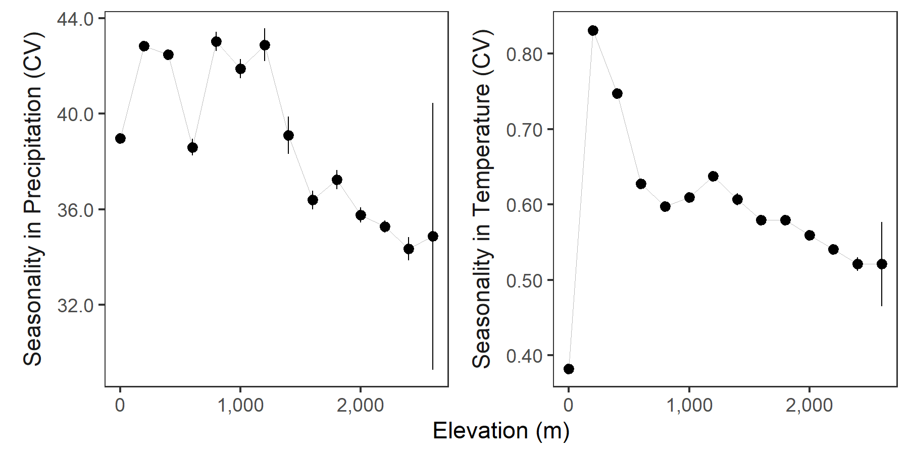
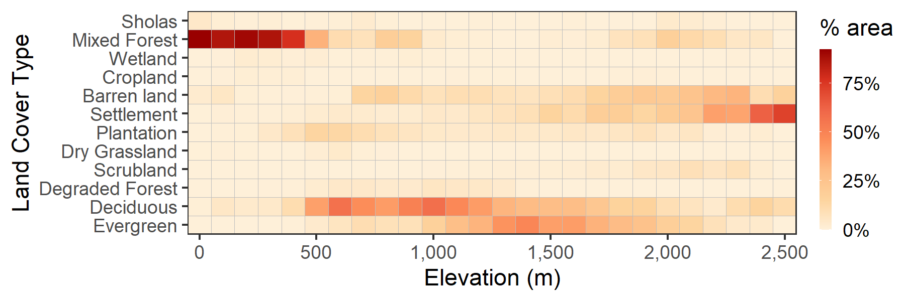

## Climate in relation to elevation

### Prepare libraries

```{r prep_libs_supp03, eval=FALSE}
# load libs
library(raster)
library(glue)
library(purrr)
library(dplyr)
library(tidyr)

library(scales)
library(ggplot2)
library(ggthemes)

# get ci func
ci <- function(x){qnorm(0.975)*sd(x, na.rm = T)/sqrt(length(x))}
```


```{r load_rasters_supp3, eval=FALSE}
# read landscape prepare for plotting
landscape <- stack("data/spatial/landscape_resamp01km.tif")

# get proper names
elev_names <- c("elev", "slope", "aspect")
chelsa_names <- c("chelsa_bio10_04", "chelsa_bio10_17", "chelsa_bio10_18",
                  "chelsa_prec", "chelsa_temp")

names(landscape) <- as.character(glue('{c(elev_names, chelsa_names, "landcover")}'))
```

```{r get_data_at_elev, eval=FALSE}
# make duplicate stack
land_data <- landscape[[c("elev", chelsa_names)]]

# convert to list
land_data <- as.list(land_data)

# map get values over the stack
land_data <- purrr::map(land_data, getValues)
names(land_data) <- c("elev", chelsa_names)

# conver to dataframe and round to 100m
land_data <- bind_cols(land_data)
land_data <- drop_na(land_data) %>% 
  mutate(elev_round  = plyr::round_any(elev, 200)) %>% 
  select(-elev) %>% 
  pivot_longer(cols = contains("chelsa"),
               names_to = "clim_var") %>% 
  group_by(elev_round, clim_var) %>% 
  summarise_all(.funs = list(~mean(.), ~ci(.)))
```

### Plot climatic variables over elevation

```{r plot_clim_elev, eval=FALSE}
# plot in facets

fig_climate_elev <- ggplot(land_data)+
  geom_line(aes(x = elev_round, y = mean),
            size = 0.2, col = "grey")+
  geom_pointrange(aes(x = elev_round, y = mean, ymin=mean-ci, ymax=mean+ci),
                  size = 0.3)+
  scale_x_continuous(labels = scales::comma)+
  scale_y_continuous(labels = scales::comma)+
  facet_wrap(~clim_var, scales = "free_y")+
  theme_few()+
  labs(x = "elevation (m)", y = "CHELSA variable value")

# save as png
ggsave(fig_climate_elev, filename = "figs/fig_climate_elev.png", 
       height = 4, width = 6, device = png(), dpi = 300); dev.off()
```


```{r export_fig_clim_elev, eval=TRUE, fig.cap="CHELSA climatic variables as a function of elevation, in increments of 200m. Points represent means, while vertical lines show 95% confidence intervals."}

# show exported image

```

## Landcover in relation to elevation

### Get data from landscape rasters

```{r prep_lc_elev, eval=FALSE, message=FALSE}
# get data from landscape rasters
lc_elev <- tibble(elev = getValues(landscape[["elev"]]),
                  landcover = getValues(landscape[["landcover"]]))
# process data for proportions
lc_elev <- lc_elev %>% 
  filter(!is.na(landcover), landcover != 0) %>% 
  mutate(elev = plyr::round_any(elev, 100)) %>% 
  count(elev, landcover) %>%
  group_by(elev) %>% 
  mutate(prop = n/sum(n))
```

### Plot proportional landcover in elevation

```{r fig_lc_elev, eval=FALSE, message=FALSE}
# plot figure as tilemap
fig_lc_elev <- ggplot(lc_elev)+
  geom_tile(aes(x=elev, y=factor(landcover), 
                fill=prop), 
            col="grey99", size = 0.6)+
  scale_fill_scico(palette = "bilbao", begin = 0.0, end = 1.0)+
  scale_x_continuous(breaks = seq(0, 2500, 500), labels = comma)+
  scale_alpha_continuous(range = c(0.3, 1))+
  labs(x = "elevation (m)", 
       y = "landcover")+
  theme_few()

# export figure
ggsave(fig_lc_elev, filename = "figs/fig_lc_elev.png", 
       height = 3, width = 6, device = png(), dpi = 300); dev.off()
```

```{r show_fig_lc_elev, eval=TRUE, fig.cap="Proportional landcover (low = white, high = dark red), as a function of elevation in the study site. Data represent elevation in increments of 100m."}

# show exported image

```
