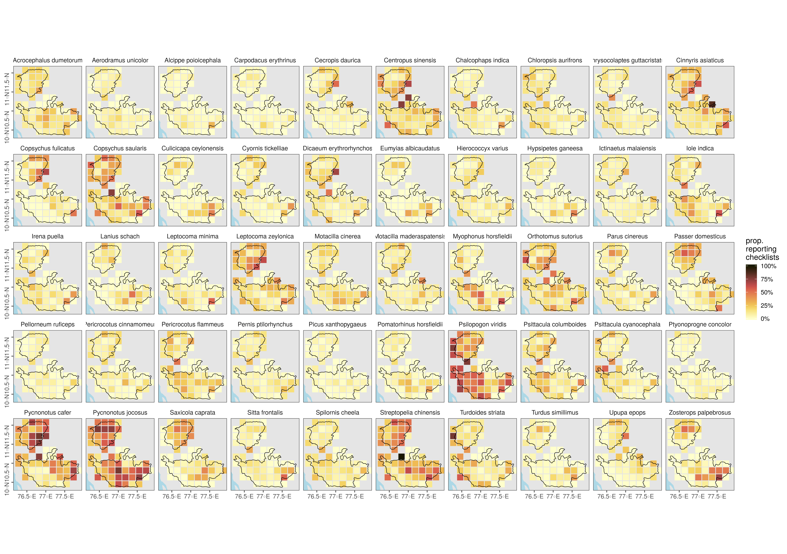

## Species observation distributions

### Prepare libraries

```{r setup_sup_02, eval=FALSE}
# load libraries
library(data.table)
library(readxl)
library(magrittr)
library(stringr)
library(dplyr)
library(tidyr)

library(ggplot2)
library(ggthemes)
library(scico)

# round any function
round_any <- function(x, accuracy = 20000){round(x/accuracy)*accuracy}
```

### Read species of interest

```{r soi_supplement, eval=FALSE, message=FALSE, warning=FALSE}
# add species of interest
specieslist <- read_excel("C:\\Users\\vr235\\Desktop\\Occupancy Runs\\Data\\3_List_of_species.xlsx")
speciesOfInterest <- specieslist$scientific_name
```

### Load raw data for locations

```{r load_raw_data_supp02, eval=FALSE}
# read in shapefile of the study area to subset by bounding box
library(sf)
wg <- st_read("C:\\Users\\vr235\\Desktop\\Occupancy Runs\\Data\\Shapefiles\\Nil_Ana_Pal.shp"); box <- st_bbox(wg)

# read in data and subset
ebd <- fread("C:\\Users\\vr235\\Desktop\\Occupancy Runs\\Data\\eBirdDataWG_filtered.txt")
ebd <- ebd[between(LONGITUDE, box["xmin"], box["xmax"]) & 
            between(LATITUDE, box["ymin"], box["ymax"]),]
ebd <- ebd[year(`OBSERVATION DATE`) >= 2013,]

# make new column names
newNames <- str_replace_all(colnames(ebd), " ", "_") %>%
  str_to_lower()
setnames(ebd, newNames)

# keep useful columns
columnsOfInterest <- c("scientific_name","observation_count","locality",
    "locality_id","locality_type","latitude","longitude","observation_date", "sampling_event_identifier")
ebd <- ebd[,..columnsOfInterest]
```

```{r strict_filter_supp02, eval=FALSE}
# strict spatial filter and assign grid
locs <- ebd[,.(longitude, latitude)]

# transform to UTM and get 20km boxes
coords <- setDF(locs) %>% 
  st_as_sf(coords = c("longitude", "latitude")) %>% 
  `st_crs<-`(4326) %>% 
  bind_cols(as.data.table(st_coordinates(.))) %>%  
  st_transform(32643) %>% 
  mutate(id = 1:nrow(.))

# convert wg to UTM for filter
wg <- st_transform(wg, 32643)
coords <- coords %>% 
  filter(id %in% unlist(st_contains(wg, coords))) %>% 
  rename(longitude = X, latitude = Y) %>% 
  bind_cols(as.data.table(st_coordinates(.))) %>%
  st_drop_geometry() %>% 
  as.data.table()

# remove unneeded objs
rm(locs); gc()

coords <- coords[,.N,by=.(longitude, latitude, X, Y)]

ebd <- merge(ebd, coords, all = FALSE, by = c("longitude", "latitude"))

ebd <- ebd[(longitude %in% coords$longitude) & (latitude %in% coords$latitude),]
```

### Get proportional obs counts in 20km cells

```{r count_obs_cell, eval=FALSE}
# round to 20km cell in UTM coords
ebd[,`:=`(X = round_any(X), Y = round_any(Y))]

# count checklists in cell
ebd_summary <- ebd[,nchk := length(unique(sampling_event_identifier)), by=.(X,Y)]

# count checklists reporting each species in cell and get proportion
ebd_summary <- ebd_summary[,.(nrep = length(unique(sampling_event_identifier))),
   by = .(X,Y,nchk,scientific_name)]

ebd_summary[,p_rep := nrep/nchk ]

# filter for soi
ebd_summary <- ebd_summary[scientific_name %in% speciesOfInterest,]

# complete the dataframe for no reports
# keep no reports as NA --- allows filtering based on proportion reporting
ebd_summary <- setDF(ebd_summary) %>% 
  complete(nesting(X,Y), scientific_name #, 
    # fill = list(p_rep = 0)
    ) %>%
  filter(!is.na(p_rep))
```

### Which species are reported sufficiently in checklists?

```{r eval=TRUE}
# total number of checklists across unique grids
# A total of 59 unique grids across the study area
tot_n_chklist <- ebd_summary %>%
    distinct(X,Y,nchk)

# species-specific number of grids
spp_grids <- ebd_summary %>%
          group_by(scientific_name) %>%
          distinct(X,Y) %>%
          count(scientific_name)
names(spp_grids)[2] <- "n_grids"

# left-join the datasets
ebd_summary <- left_join(ebd_summary,spp_grids, by="scientific_name")

# check the proportion of grids across which this cut-off is met for each species
# Is it > 90% or 70%?
# Not really justifiable: For example, with a 3% cut-off, only~100 species are occurring in >50% of the grids they have been reported in

p_cutoff <- 0.03
grid_proportions <- ebd_summary %>%
          group_by(scientific_name) %>%
          count(p_rep>p_cutoff) %>% 
          mutate(prop_grids_cut = n[2]/(n[1]+n[2]))%>%
          distinct(scientific_name,prop_grids_cut) %>%
          arrange(desc(prop_grids_cut))
          
# Identifying the number of species that occur in potentially <5% of all lists

total_number_lists <- sum(tot_n_chklist$nchk)

spp_sum_chk <- ebd_summary %>%
  distinct(X,Y, scientific_name, nrep) %>%
  group_by(scientific_name) %>%
  mutate(sum_chk = sum(nrep)) %>%
  distinct(scientific_name,sum_chk)

# Approximately 90 to 100 species occur in >5% of all checklists
prop_all_lists <- spp_sum_chk %>%
      mutate(prop_lists = sum_chk/total_number_lists) %>%
      arrange(desc(prop_lists))

```


### Plot maps

```{r load_map_plot_data, eval=FALSE}
# add land
library(rnaturalearth)
land <- ne_countries(scale = 50, type = "countries", continent = "asia",
                     country = "india",
                     returnclass = c("sf"))

# crop land
land <- st_transform(land, 32643)
```

```{r plot_obs_distributions, eval=FALSE}
# make plot
wg <- st_transform(wg, 32643)
bbox <- st_bbox(wg)

plotDistributions <-
ggplot()+
  geom_sf(data = land, fill = "grey90", col = NA)+
  geom_tile(data = ebd_summary,
            aes(X, Y, fill = p_rep), lwd = 0.5, col = "grey90")+
  geom_sf(data = wg, fill = NA, col = "black", lwd = 0.3)+
  
  scale_fill_scico(palette = "lajolla", direction = 1, label = scales::percent)+
  facet_wrap(~scientific_name, ncol = 7)+
  coord_sf(xlim = bbox[c("xmin", "xmax")], ylim = bbox[c("ymin", "ymax")])+
  theme_few()+
  theme(legend.position = "right", 
        axis.title = element_blank(),
        axis.text.y = element_text(angle = 90),
        panel.background = element_rect(fill = "lightblue"))+
  labs(fill = "prop.\nreporting\nchecklists")
  
# export data
ggsave(plotDistributions, filename = "figs/fig_species_distributions.png", 
       height = 12, width = 17, device = png(), dpi = 300); dev.off()
```

```{r export_fig_obs_dist, eval=TRUE, fig.cap="Proportion of checklists reporting a species in each grid cell (20km side) between 2013 and 2018. Checklists were filtered to be within the boundaries of the Nilgiris, Anamalais and the Palani hills (black outline), but rounding to 20km cells may place cells outside the boundary. Deeper shades of red indicate a higher proportion of checklists reporting a species."}

# show exported image


```