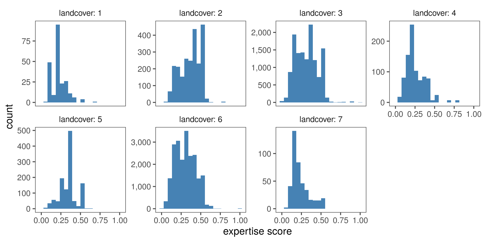

## Obsever expertise in time and space

### Prepare libraries

```{r prep_libs_supp05, eval=FALSE}
# load libs
library(raster)
library(glue)
library(purrr)
library(dplyr)
library(tidyr)
library(readr)
library(scales)

# plotting libs
library(ggplot2)
library(ggthemes)
library(scico)

# get ci func
ci <- function(x){qnorm(0.975)*sd(x, na.rm = T)/sqrt(length(x))}
```

```{r load_data_supp05, eval=FALSE, message=FALSE}
# read in scores and checklist data and link
scores <- read_csv("data/dataObsExpScore.csv")
data <- read_csv("data/eBirdChecklistVars.csv")

data <- left_join(data, scores, by = c("observer" = "observer"))
data <- select(data, score, nSp, nSoi, landcover, year) %>% 
  filter(!is.na(score))
```

### Species seen in relation to osberver expertise

```{r nsp_expertise, eval=FALSE, message=FALSE}
# summarise data by rounded score and year
data_summary01 <- data %>% 
  mutate(score = plyr::round_any(score, 0.2)) %>% 
  select(score, year, nSp, nSoi) %>% 
  pivot_longer(cols = c("nSp", "nSoi"),
               names_to = "variable", values_to = "value") %>% 
  group_by(score, year, variable) %>% 
  summarise_at(vars(value), list(~mean(.), ~ci(.)))

# make plot and export
fig_nsp_score <- 
  ggplot(data_summary01)+
  geom_jitter(data = data, aes(x = score, y = nSp), 
             col = "grey", alpha = 0.2, size = 0.1)+
  geom_pointrange(aes(x = score, y = mean, 
                      ymin=mean-ci, ymax=mean+ci,
                      col = as.factor(variable)),
                  position = position_dodge(width = 0.05))+
  facet_wrap(~year)+
  scale_y_log10()+
#  coord_cartesian(ylim=c(0,50))+
  scale_colour_scico_d(palette = "cork", begin = 0.2, end = 0.8)+
  labs(x = "expertise score", y = "species reported")+
  theme_few()+
  theme(legend.position = "none")

# export figure
ggsave(filename = "figs/fig_nsp_score.png", width = 8, height = 6, device = png(), dpi = 300); dev.off()
```

```{r show_fig_nsp_score, eval=TRUE, fig.cap="Total number of species (blue) and species of interest to this study (green) reported in checklists from the study area over the years 2013 -- 2018, as a function of the expertise score of the reporting observer. Points represent means, with bars showing the 95% confidence intervals; data shown are for expertise scores rounded to multiples of 0.2, and the y-axis is on a log scale. Raw data are shown in the background (grey points)."}

# show exported image
knitr::include_graphics("figs/fig_nsp_score.png")
```

### Expertise in relation to landcover

```{r exp_landcover, eval=FALSE, message=FALSE}
# plot histograms of expertise scores in different landcover classes
data <- filter(data, !is.na(landcover))

# make plot
fig_exp_lc <- ggplot(data)+
  geom_histogram(aes(x = score), fill = "steelblue", bins = 20)+
  facet_wrap(~landcover, scales = "free_y", labeller = label_both, nrow = 2)+
  scale_y_continuous(labels = comma)+
  theme_few()+
  theme(legend.position = "none")+
  labs(x = "expertise score", y = "count")

# export figure

ggsave(filename = "figs/fig_exp_lc.png", width = 8, height = 4, device = png(), dpi = 300); dev.off()
```

```{r show_fig_exp_lc, eval=TRUE, fig.cap="Distribution of expertise scores in the seven landcover classes present in the study site."}

# show exported image

```
