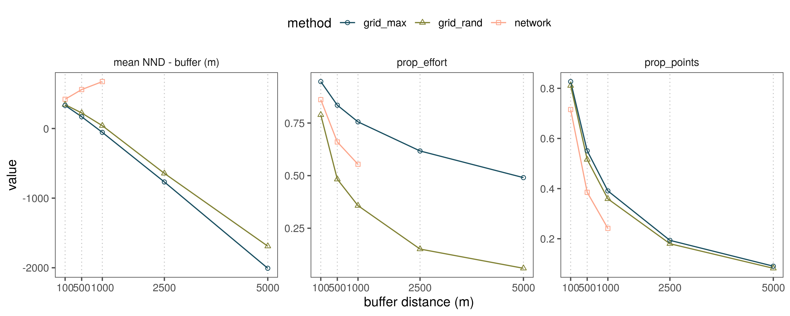

## Spatial thinning: A comparison of approaches

### Prepare libraries

```{r load_libs_sm_07, eval=FALSE, message=FALSE, warning=FALSE}
# load libraries
library(tidyverse)
library(glue)
library(readr)
library(sf)

# plotting
library(ggthemes)
library(scico)
library(scales)

# ci func
ci <- function(x){qnorm(0.975)*sd(x, na.rm = T)/sqrt(length(x))}

# load python libs here
library(reticulate)
# set python path
use_python("/usr/bin/python3")
```

### Traditional grid-based thinning

```{r load_checklist_data, eval=FALSE, message=FALSE, warning=FALSE}
# load wg
wg <- st_read("data/spatial/hillsShapefile/Nil_Ana_Pal.shp") %>% 
  st_transform(32643)

# get scales
# load checklist data and select one per rounded 500m coordinates
{
  data <- read_csv("data/eBirdChecklistVars.csv") %>% 
    count(longitude, latitude, name = "tot_effort")
    
  
  # how many unique points
  n_all_points <- nrow(data)
  d_all_effort <- sum(data$tot_effort)
  
  # round to different scales
  scale <- c(100, 250, 500, 1000)
  
  # group data by scale
  data <- crossing(scale, data) %>% 
    group_by(scale) %>% 
    nest() %>% 
    ungroup()
}

# select one point per grid cell
data <- mutate(data, data = map2(scale, data, function(sc, df){
  # transform the data
  df <- df %>% 
    st_as_sf(coords = c("longitude", "latitude")) %>% 
    `st_crs<-`(4326) %>% 
    st_transform(32643) %>% 
    bind_cols(as_tibble(st_coordinates(.))) %>% 
    mutate(coordId = 1:nrow(.),
           X_round = plyr::round_any(X, sc),
           Y_round = plyr::round_any(Y, sc))
  
  # make a grid
  grid <- st_make_grid(wg, cellsize = sc)
  
  # which cell contains which points
  grid_contents <- st_contains(grid, df) %>% 
    as_tibble() %>% 
    rename(cell = row.id, coordId = col.id)
  
  rm(grid)
  
  # what's the max point in each grid
  points_max <- left_join(df %>% st_drop_geometry(),
                   grid_contents, by = "coordId") %>% 
    group_by(cell) %>% 
    filter(tot_effort == max(tot_effort))
  
  # get summary for max
  max_sites <- points_max %>% 
    ungroup() %>% 
    summarise(prop_points= length(coordId)/n_all_points,
              prop_effort = sum(tot_effort)/d_all_effort) %>% 
    pivot_longer(cols = everything(),
                 names_to = "variable")
  
  # select a random point in each grid
  points_rand <- left_join(df %>% st_drop_geometry(),
                   grid_contents, by = "coordId") %>% 
    group_by(cell) %>% 
    sample_n(size = 1)
  
  # get summary for rand
  rand_sites <- points_rand %>% 
    ungroup() %>% 
    summarise(prop_points = length(coordId)/n_all_points,
              prop_effort = sum(tot_effort)/d_all_effort) %>% 
    pivot_longer(cols = everything(),
                 names_to = "variable")
  
  df <- tibble(grid_rand = list(rand_sites), grid_max = list(max_sites),
               points_rand = list(points_rand), points_max = list(points_max))
}))

# unnest data
data <- unnest(data, cols = data)

# save summary as another object
data_thin_trad <- data %>% 
  select(-contains("points")) %>% 
  pivot_longer(cols = -contains("scale"),
               names_to = "method", values_to = "somedata") %>% 
  unnest(cols = somedata)

# save points for later comparison
points_thin_trad <- data %>% 
  select(contains("points"), scale)

rm(data)
```

### Network-based thinning

Load python libraries.

```{python prep_py_libs_supp07, eval=FALSE, message=FALSE, warning=FALSE}
# import classic python libs
import numpy as np
import matplotlib.pyplot as plt

# libs for dataframes
import pandas as pd

# network lib
import networkx as nx

# import libs for geodata
import geopandas as gpd

# import ckdtree
from scipy.spatial import cKDTree
```

#### Finding modularity in proximity networks

```{python make_and_write_networks, eval=FALSE, message=FALSE, warning=FALSE}
# read in checklist covariates for conversion to gpd
# get unique coordinates, assign them to the df
# convert df to geo-df
chkCovars = pd.read_csv("data/eBirdChecklistVars.csv")
ul = chkCovars[['longitude', 'latitude']].drop_duplicates(subset=['longitude', 'latitude'])
ul['coordId'] = np.arange(0, ul.shape[0])

# get effort at each coordinate
effort = chkCovars.groupby(['longitude', 'latitude']).size().to_frame('tot_effort')
effort = effort.reset_index()

# merge effort on ul
ul = pd.merge(ul, effort, on=['longitude', 'latitude'])

# make gpd and drop col from ul
ulgpd = gpd.GeoDataFrame(ul, geometry=gpd.points_from_xy(ul.longitude, ul.latitude))
ulgpd.crs = {'init' :'epsg:4326'}
# reproject spatials to 43n epsg 32642
ulgpd = ulgpd.to_crs({'init': 'epsg:32642'})
ul = pd.DataFrame(ul.drop(columns="geometry"))

# function to use ckdtrees for nearest point finding
def ckd_pairs(gdfA, dist_indep):
    A = np.concatenate([np.array(geom.coords) for geom in gdfA.geometry.to_list()])
    ckd_tree = cKDTree(A)
    dist = ckd_tree.query_pairs(r=dist_indep, output_type='ndarray')
    return dist

# define scales in metres
scales = [100, 250, 500, 1000]


# function to process ckd_pairs
def make_modules(scale):
    site_pairs = ckd_pairs(gdfA=ulgpd, dist_indep=scale)
    site_pairs = pd.DataFrame(data=site_pairs, columns=['p1', 'p2'])
    site_pairs['scale'] = scale
    # get site ids
    site_id = np.concatenate((site_pairs.p1.unique(), site_pairs.p2.unique()))
    site_id = np.unique(site_id)
    # make network
    network = nx.from_pandas_edgelist(site_pairs, 'p1', 'p2')
    # get modules
    modules = list(nx.algorithms.community.greedy_modularity_communities(network))
    # get modules as df
    m = []
    for i in np.arange(len(modules)):
        module_number = [i] * len(modules[i])
        module_coords = list(modules[i])
        m = m + list(zip(module_number, module_coords))
    # add location and summed sampling duration
    unique_locs = ul[ul.coordId.isin(site_id)]
    module_data = pd.DataFrame(m, columns=['module', 'coordId'])
    module_data = pd.merge(module_data, unique_locs, on='coordId')
    # add scale
    module_data['scale'] = scale
    return [site_pairs, module_data]


# run make modules on ulgpd at scales
data = list(map(make_modules, scales))

# extract data for output
tot_pair_data = []
tot_module_data = []
for i in np.arange(len(data)):
    tot_pair_data.append(data[i][0])
    tot_module_data.append(data[i][1])

tot_pair_data = pd.concat(tot_pair_data, ignore_index=True)
tot_module_data = pd.concat(tot_module_data, ignore_index=True)

# make dict of positions and array of coordinates
# site_id = np.concatenate((site_pairs.p1.unique(), site_pairs.p2.unique()))
# site_id = np.unique(site_id)
# locations_df = ul[ul.coordId.isin(site_id)][['longitude', 'latitude']].to_numpy()
# pos_dict = dict(zip(site_id, locations_df))

# output data
tot_module_data.to_csv(path_or_buf="data/site_modules.csv", index=False)
tot_pair_data.to_csv(path_or_buf="data/site_pairs.csv", index=False)

# ends here

```

#### Process proximity networks in R

```{r continue_network_thinning, eval=FALSE, message=FALSE, warning=FALSE}
# read in pair and module data
pairs <- read_csv("data/site_pairs.csv")
mods <- read_csv("data/site_modules.csv")

# count pairs at each scale
count(pairs, scale)
pairs %>% 
  group_by(scale) %>% 
  summarise(non_indep_pairs = length(unique(c(p1, p2)))/n_all_points)
count(mods, scale)

# nest by scale and add module data
data <- nest(pairs, data = c(p1, p2))
modules <- group_by(mods, scale) %>% 
  nest() %>% ungroup()

# add module data
data <- mutate(data, 
               modules = modules$data,
               data = map2(data, modules, function(df, m){
                 df <- left_join(df, m, by = c("p1" = "coordId"))
                 df <- left_join(df, m, by = c("p2" = "coordId"))
                 
                 df <- filter(df, module.x == module.y)  
                 return(df)
               })) %>% 
  select(-modules)

# split by module
data$data <- map(data$data, function(df){
  df <- group_by(df, module.x, module.y) %>% 
    nest() %>% 
    ungroup()
  return(df)
})
```

#### A function that removes sites

```{r func_select_sites, eval=FALSE, message=FALSE, warning=FALSE}

# a function to remove sites
remove_which_sites <- function(pair_data){
  
  {
    a = pair_data %>%  
      select(p1, p2)
    
    nodes_a_init = unique(c(a$p1, a$p2))
    
    i_n_d = filter(mods, coordId %in% nodes_a_init) %>% 
      select(node = coordId, duration) %>% 
      mutate(s_f_r = NA)
    
    nodes_keep = c()
    nodes_removed = c()
  }
  
  while(nrow(a) > 0){
    
    # how many nodes in a
    nodes_a = unique(c(a$p1, a$p2))
    
    # get node or site efforts and arrange in ascending order
    b = i_n_d %>% filter(node %in% nodes_a)
    
    for (i in 1:nrow(b)){
      # which node to remove
      node_out = b$node[i]
      # how much duration lost
      d_n_o = b$duration[i]
      
      # how many rows remain in a if node_out is removed?
      a_n_o = filter(a, p1 != node_out, p2 != node_out)
      indep_nodes = setdiff(nodes_a, unique(c(a_n_o$p1, a_n_o$p2, node_out)))
      
      # how much sampling effort made spatially independent
      indep_sampling = filter(b, node %in% indep_nodes) %>% 
        summarise(duration = sum(duration)) %>% 
        .$duration
      
      # message(glue::glue('{node_out} removal frees {indep_sampling} m'))
      # sampling freed by sampling lost
      b$s_f_r[i] = indep_sampling/d_n_o
    }
    
    # arrange node data by decreasing sfr and increasing duration
    # highest duration nodes are processed last
    b = arrange(b, -s_f_r, duration)
    
    nodes_removed = c(nodes_removed, b$node[1])
    
    # remove pairs of nodes containing the highest sfr node in b
    a = filter(a, p1 != b$node[1], p2 != b$node[1])
    
    nodes_keep = c(nodes_keep, setdiff(nodes_a, unique(c(a$p1, a$p2, nodes_removed))))
    
  }
  
  message(glue::glue('keeping {length(nodes_keep)} of {length(nodes_a_init)}'))
  
  # node_status <- tibble(nodes = c(nodes_keep, nodes_removed),
  #                       status = c(rep(TRUE, length(nodes_keep)),
  #                                  rep(FALSE, length(nodes_removed))))
  
  return(as.integer(nodes_removed))
}

```

#### Removing non-independent sites

```{r apply_select_sites, eval=FALSE, message=FALSE}
# remove 5km and 2.5km scale
data <- data %>% filter(scale <=1000)
# run select sites on the various modules
sites_removed <- map(data$data, function(df){
  remove_sites <- unlist(purrr::map(df$data, remove_which_sites))
})

# save as rdata
save(sites_removed, file = "data/data_network_sites_removed.rdata")
```

```{r remove_network_thinned_sites, eval=FALSE, message=FALSE, warning=FALSE}
# get python sites
ul = py$ul

# subset sites
data <- mutate(data,
               data = map(sites_removed, function(site_id){
                 as_tibble(filter(ul, !coordId %in% site_id))
               }))

# which points are kept
points_thin_net <- mutate(data,
                          data = map(data,function(df){
                            df <- df %>% 
                              select("longitude", "latitude") %>% 
                              st_as_sf(coords = c("longitude", "latitude")) %>% 
                              `st_crs<-`(4326) %>% 
                              st_transform(32643) %>% 
                              bind_cols(as_tibble(st_coordinates(.))) %>% 
                              st_drop_geometry()
                          }))

# get metrics for method
data_thin_net <- unnest(data, cols = "data") %>% 
  group_by(scale) %>% 
  summarise(prop_points = length(coordId)/n_all_points,
            prop_effort = sum(duration)/d_all_effort) %>% 
  mutate(method = "network") %>% 
  pivot_longer(cols = -one_of(c("method", "scale")),
               names_to = "variable")
```

### Measuring method fallibility

How many points, at different spatial scales, remain after the application of each method?

#### Prepare data for Python

```{r compare_points_remaining, eval=FALSE, message=FALSE, warning=FALSE}

# get points by each method
points_list <- append(points_thin_net$data, values = append(points_thin_trad$points_rand,
                                                            points_thin_trad$points_max))

# get scales as list
scales_list <- list(100,500,1000, rep(c(100,500,1000), 2)) %>% flatten()

# send to python
py$points_list = points_list
py$scales_list = scales_list
```


#### Count props under threshold in Python

```{python, process_for_spat_indep, eval=FALSE, message=FALSE, warning=FALSE}
# transform each element to gpd


# a function to convert to gpd
def make_gpd(df):
    df = gpd.GeoDataFrame(df, geometry=gpd.points_from_xy(df.X, df.Y))
    df.crs = {'init' :'epsg:32643'}
    return df


# function for mean nnd
# function to use ckdtrees for nearest point finding
def ckd_test(gdfA, gdfB, dist_indep):
    A = np.concatenate([np.array(geom.coords) for geom in gdfA.geometry.to_list()])
    #simplified_features = simplify_roads(gdfB)
    B = np.concatenate([np.array(geom.coords) for geom in gdfB.geometry.to_list()])
    #B = np.concatenate(B)
    ckd_tree = cKDTree(B)
    dist, idx = ckd_tree.query(A, k=[2])
    dist_diff = list(map(lambda x: x - dist_indep, dist))
    mean_dist_diff = np.asarray(dist_diff).mean()
    return mean_dist_diff


# apply to all data
points_list = list(map(make_gpd, points_list))

# get nnb all data
mean_dist_diff = list(map(ckd_test, points_list, points_list, scales_list))

# count points above threshold
# n_non_indep = []
# for i in np.arange(len(points_list)):
#     ni_pairs = ckd_test(gdfA=points_list[i],gdfB=points_list[i], dist_indep=scales_list[i])
#     ni_pairs = pd.DataFrame(data=ni_pairs, columns=['p1', 'p2'])
#     site_id = np.concatenate((ni_pairs.p1.unique(), ni_pairs.p2.unique()))
#     ni_sites = len(np.unique(site_id))/points_list[i].shape[0]
#     n_non_indep.append(ni_sites)

```


### Plot metrics for different methods

```{r compare_methods_plot, eval=FALSE, message=FALSE, warning=FALSE}
# combine the thinning metrics data
data_plot <- bind_rows(data_thin_net, data_thin_trad)

# get data for mean distance
data_thin_compare <- tibble(scale = unlist(scales_list),
                            method = c(rep("network", 3),
                                       rep("grid_rand", 5),
                                       rep("grid_max", 5)),
                            `mean NND - buffer (m)` = unlist(py$mean_dist_diff)) %>% 
  pivot_longer(cols = "mean NND - buffer (m)",
               names_to = "variable")

# bind rows with other data
data_plot <- bind_rows(data_plot, data_thin_compare)

# plot results
fig_spatial_thinning <-
  ggplot(data_plot)+
  geom_vline(xintercept = scale, lty = 3, colour="grey", lwd=0.4)+
  geom_line(aes(x = scale, y= value, col =method))+
  geom_point(aes(x = scale, y= value, col =method, shape = method))+
  facet_wrap(~variable, scales = "free")+
  scale_shape_manual(values = c(1, 2, 0))+
  scale_x_continuous(breaks = scale)+
  scale_y_continuous()+
  scale_colour_scico_d(palette = "batlow", begin=0.2, end=0.8)+
  theme_few()+
  theme(legend.position = "top")+
  labs(x= "buffer distance (m)")

# save
ggsave(fig_spatial_thinning, filename = "figs/fig_spatial_thinning_02.png", width = 10, height = 4,
       dpi=300); dev.off()
```

```{r fig_spatial_thinning, eval=TRUE}

```

