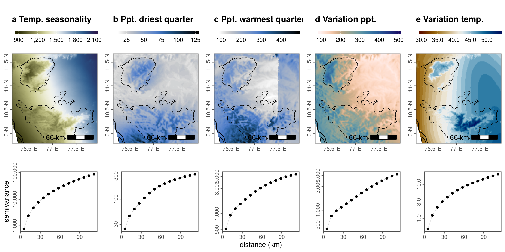

## Spatial autocorrelation in climatic predictors

### Load libs and prep data

```{r load_libs_supp06, eval=FALSE, message=FALSE}
# load libs
library(raster)
library(gstat)
library(stars)
library(purrr)
library(tibble)
library(dplyr)
library(tidyr)
library(glue)
library(scales)
library(gdalUtils)

# plot libs
library(ggplot2)
library(ggthemes)
library(scico)
library(gridExtra)
library(cowplot)
library(ggspatial)

#'make custom functiont to convert matrix to df
raster_to_df <- function(inp) {
  
  # assert is a raster obj
  assertthat::assert_that("RasterLayer" %in% class(inp),
                          msg = "input is not a raster")
  
  coords <- coordinates(inp)
  vals <- getValues(inp)
  
  data <- tibble(x = coords[,1], y = coords[,2], value = vals)
  
  return(data)
}
```

```{r load_data_supp06, eval=FALSE, message=FALSE}
# list landscape covariate stacks
landscape_files <- "data/spatial/landscape_resamp01km.tif"
landscape_data <- stack(landscape_files)

# get proper names
{
  elev_names <- c("elev", "slope", "aspect")
  chelsa_names <- c("chelsa_bio10_04", "chelsa_bio10_17", "chelsa_bio10_18","chelsa_prec", "chelsa_temp")
  names(landscape_data) <- as.character(glue('{c(elev_names, chelsa_names, "landcover")}'))
}

# get chelsa rasters
chelsa <- landscape_data[[chelsa_names]]
chelsa <- purrr::map(as.list(chelsa), raster_to_df)
```

### Calculate variograms

```{r make_variograms, eval=FALSE, message=FALSE}
# prep variograms
vgrams <- purrr::map(chelsa, function(z){
  z <- drop_na(z)
  vgram <- gstat::variogram(value~1, loc=~x+y, data = z)
  return(vgram)
})

# save temp
save(vgrams, file = "data/chelsa/chelsaVariograms.rdata")

# get variogram data
vgrams <- purrr::map(vgrams, function(df){
  df %>% select(dist, gamma)
})
vgrams <- tibble(variable = chelsa_names,
                 data = vgrams)
```

```{r load_map_data, eval=FALSE, message = FALSE}
wg <- st_read("data/spatial/hillsShapefile/Nil_Ana_Pal.shp") %>% 
  st_transform(32643)
bbox <- st_bbox(wg)

# add lamd
library(rnaturalearth)
land <- ne_countries(scale = 50, type = "countries", continent = "asia",
                     country = "india",
                     returnclass = c("sf"))

# crop land
land <- st_transform(land, 32643)
```

### Plot CHELSA data and variograms

```{r plot_variograms_maps, eval=FALSE, message=FALSE}
# make ggplot of variograms
yaxis <- c("semivariance", rep("", 4))
xaxis <- c("", "", "distance (km)", "", "")
fig_vgrams <- purrr::pmap(list(vgrams$data, yaxis, xaxis), function(df, ya, xa){
  
  ggplot(df)+
    geom_line(aes(x = dist/1000, y = gamma), size = 0.2, col = "grey")+
    geom_point(aes(x = dist/1000, y = gamma), col = "black")+
    scale_x_continuous(labels = comma, breaks = c(seq(0,100,25)))+
    scale_y_log10(labels = comma)+
    labs(x = xa, y = ya)+
    theme_few()+
    theme(axis.text.y = element_text(angle = 90, hjust = 0.5, size = 8),
          strip.text = element_blank())
  
})
fig_vgrams <- purrr::map(fig_vgrams, as_grob)

# make ggplot of chelsa data
chelsa <- as.list(landscape_data[[chelsa_names]]) %>% 
  purrr::map(st_as_stars)

# colour palettes
pal <- c("bilbao", "davos", "davos", "nuuk", "bilbao")
title <- c("a Temp. seasonality",
           "b Ppt. driest qtr.",
           "c Ppt. warmest qtr.",
           "d Variation ppt.",
           "e Variation temp.")
direction <- c(1,-1,-1,-1,1)
lims <- list(range(chelsa[[1]]$chelsa_bio10_04, na.rm = T), 
             c(0, 500), c(0, 500),
             c(0,500),#range(chelsa[[4]]$chelsa_prec, na.rm = T),
             range(chelsa[[5]]$chelsa_temp, na.rm = T))
fig_list_chelsa <- 
  purrr::pmap(list(chelsa, pal, title, direction, lims), 
              function(df, pal, t, d, l){
                ggplot()+
                  geom_stars(data = df)+
                  geom_sf(data = land, fill = NA, colour = "black")+
                  geom_sf(data = wg, fill = NA, colour = "black", size = 0.3)+
                  scale_fill_scico(palette = pal, direction = d, 
                                   label = comma, na.value = NA, limits = l)+
                  coord_sf(xlim = bbox[c("xmin", "xmax")], 
                           ylim = bbox[c("ymin", "ymax")])+
                  annotation_scale(location = "tr", width_hint = 0.4, text_cex = 1) +
                  
                  theme_few()+
                  theme(legend.position = "top",
                        title = element_text(face = "bold", size = 8),
                        legend.key.height = unit(0.2, "cm"),
                        legend.key.width = unit(1, "cm"),
                        legend.text = element_text(size = 8),
                        axis.title = element_blank(),
                        axis.text.y = element_text(angle = 90, hjust = 0.5),
                        # panel.background = element_rect(fill = "lightblue"),
                        legend.title = element_blank())+
                  labs(x=NULL, y=NULL, title = t)
              })
fig_list_chelsa <- purrr::map(fig_list_chelsa, as_grob)
```

```{r prep_figures_vgrams, eval=FALSE, message=FALSE}
fig_list_chelsa <- append(fig_list_chelsa, fig_vgrams)
lmatrix <- matrix(c(c(1,2,3,4,5), c(1,2,3,4,5), c(6,7,8,9,10)), nrow = 3, byrow = T)
plot_grid <- grid.arrange(grobs = fig_list_chelsa, layout_matrix = lmatrix)

ggsave(plot = plot_grid, filename = "figs/fig_chelsa_variograms.png", dpi = 300, width = 12, height = 6)
```

```{r show_fig_chelsa, eval=TRUE, fig.cap="CHELSA rasters with study area outline, and associated semivariograms. Semivariograms are on a log-transformed y-axis."}

# show exported image

```

## Climatic raster resampling

### Prepare landcover

```{r resample_landcover_mult, eval=FALSE, warning=FALSE, message=FALSE}
# read in landcover raster location
landcover <- "data/landUseClassification/Reprojected Image_26thJan2020_UTM_Ghats.tif"
# get extent
e = bbox(raster(landcover))

# init resolution
res_init <- res(raster(landcover))
# res to transform to 1000m
res_final <- map(c(100, 250, 500, 1e3, 2.5e3), function(x){x*res_init})

# use gdalutils gdalwarp for resampling transform
# to 1km from 10m
for (i in 1:length(res_final)) {
  this_res <- res_final[[i]]
  this_res_char <- stringr::str_pad(this_res[1], 5, pad = "0")
  gdalwarp(srcfile = landcover, 
          dstfile = as.character(glue('data/landUseClassification/lc_{this_res_char}m.tif')), 
          tr=c(this_res), r='mode', te=c(e))
}

```

```{r read_resampled_lc, eval=FALSE, message=FALSE, warning=FALSE}
# read in resampled landcover raster files as a list
lc_files <- list.files("data/landUseClassification/", pattern = "lc", full.names = TRUE)
lc_data <- map(lc_files, raster)
```

### Prepare spatial extent

```{r load_hills_s06, eval=FALSE, message=FALSE, warning=FALSE}
# load hills
library(sf)
hills <- st_read("data/spatial/hillsShapefile/Nil_Ana_Pal.shp")
hills <- st_transform(hills, 32643)
buffer <- st_buffer(hills, 3e4) %>% 
  st_transform(4326)
bbox <- st_bbox(hills)
```

### Prepare CHELSA rasters

```{r chelsa_rasters_s06, eval=FALSE, message=FALSE, warning=FALSE}
# list chelsa files
chelsaFiles <- list.files("data/chelsa/", full.names = TRUE, pattern = "*.tif")

# gather chelsa rasters
chelsaData <- purrr::map(chelsaFiles, function(chr){
  a <- raster(chr)
  crs(a) <- crs(buffer)
  a <- crop(a, as(buffer, "Spatial"))
  return(a)
})

# stack chelsa data
chelsaData <- raster::stack(chelsaData)
names(chelsaData) <- c("chelsa_bio10_04", "chelsa_bio10_17", "chelsa_bio10_18","chelsa_prec", "chelsa_temp")
```

### Resample prepared rasters

```{r resample_clim_rasters, eval=FALSE, message=FALSE}
# make resampled data
resamp_data <- map(lc_data, function(this_scale){
  rr <- projectRaster(from = chelsaData, to = this_scale, 
                      crs = crs(this_scale), res = res(this_scale))
})

# make a stars list
resamp_data <- map2(resamp_data, lc_data, function(z1,z2){
  z2[z2 == 0] <- NA
  z2 <- append(z2, as.list(z1)) %>% map(st_as_stars)
}) %>% 
  flatten()
```

```{r plot_resampled_rasters, eval=FALSE, message=FALSE}
# colour palettes
pal <- c("batlow", "bilbao", "davos", "davos", "nuuk", "bilbao")
title <- c("a landcover",
           "b Temp. seasonality",
           "c Ppt. driest qtr.",
           "d Ppt. warmest qtr.",
           "e Variation ppt.",
           "f Variation temp.")
title <- c(title, rep("", 24))
direction <- c(1,1,-1,-1,-1,1)

scales <- c(c("1.0km", rep("", 5)), c("2.5km", rep("", 5)), 
            c("5.0km", rep("", 5)), c("10km", rep("", 5)), 
            c("25km", rep("", 5)))

# make figures across the list
fig_list_chelsa_resamp <- 
  purrr::pmap(list(resamp_data, scales, rep(pal, 5), title, rep(direction, 5)), 
              function(df, scale, pal, t, d){
                ggplot()+
                  geom_stars(data = df)+
                  geom_sf(data = hills, fill = NA, colour = "black", size = 0.3)+
                  scale_fill_scico(palette = pal, direction = d,
                                   label = comma, na.value = NA)+
                  coord_sf(xlim = bbox[c("xmin", "xmax")],
                           ylim = bbox[c("ymin", "ymax")])+
                  theme_void()+
                  theme(#legend.position = "top",
                    panel.border = element_rect(),
                        title = element_text(face = "bold", size = 8),
                        # legend.key.height = unit(0.1, "cm"),
                        # legend.key.width = unit(0.6, "cm"),
                        # legend.text = element_text(size = 8),
                        axis.title = element_text(),
                        axis.title.y = element_text(angle = 90),
                        # axis.text.y = element_text(angle = 90, hjust = 0.5),
                        # panel.background = element_rect(fill = "lightblue"),
                        legend.title = element_blank())+
                  labs(x=NULL, y=scale, title = t)
              })
fig_list_chelsa_resamp <- purrr::map(fig_list_chelsa_resamp, as_grob)

fig_chelsa_resamp <- grid.arrange(grobs = fig_list_chelsa_resamp, ncol=6)
ggsave(plot = fig_chelsa_resamp, filename = "figs/fig_chelsa_resamp.png", dpi = 100, width = 24, height = 12, device = png(), units = "in")

# use magick to convert
library(magick)
pl <- image_read_pdf("figs/fig_chelsa_resamp.pdf")
image_write(pl, path = "figs/fig_chelsa_resamp.png", format = "png")
```

```{r show_fig_chelsa_resamp, eval=TRUE, fig.cap="CHELSA rasters with study area outline, at different scales. Semivariograms are on a log-transformed y-axis."}

# show exported image
knitr::include_graphics("figs/fig_chelsa_resamp.png")
```