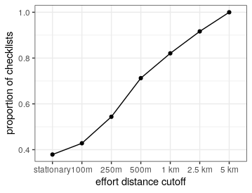

## Matching effort with spatial independence

How many sites would be lost if effort distance was restricted based on spatial independence?

### Load librarires

```{r load_libs_s08, eval=FALSE}
# load data packagaes
library(data.table)
library(dplyr)

# load plotting packages
library(ggplot2)
library(scico)
library(ggthemes)
library(scales)
```

### Load data

```{r load_data_s08, eval=FALSE}
# load checklist covariates
data <- fread("data/eBirdChecklistVars.csv")

effort_distance_summary <- data[, effort_distance_class := cut(distance, breaks = c(-1, 0.001, 0.1, 0.25, 0.5, 1, 2.5, 5, Inf), ordered_result = T)
     ][,.N, by = effort_distance_class
       ][order(effort_distance_class)]

effort_distance_summary[,prop_effort:=cumsum(effort_distance_summary$N)/nrow(data)]
```

### Plot distance exclusion effect

```{r make_plots_s08, eval=FALSE}
# plot effort distance class cumulative sum
fig_dist_exclusion <- ggplot(effort_distance_summary)+
  geom_point(aes(effort_distance_class, prop_effort), size = 3)+
  geom_path(aes(effort_distance_class, prop_effort, group = NA))+
  # scale_y_continuous(label=label_number(scale=0.001, accuracy = 1, suffix = "K"))+
  scale_x_discrete(labels = c("stationary", "100m", "250m", "500m", "1 km", "2.5 km", "5 km"))+
  theme_few()+
  theme(panel.grid = element_line(size = 0.2, color = "grey"))+
  labs(x = "effort distance cutoff", y = "proportion of checklists")

ggsave(plot = fig_dist_exclusion, "figs/fig_cutoff_effort.png", height = 6, width = 8, dpi = 300)
dev.off()
```

```{r fig_dist_exclusion, eval=TRUE}

```

